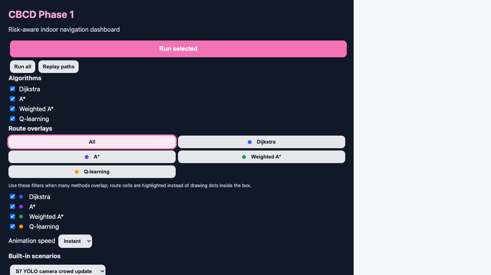
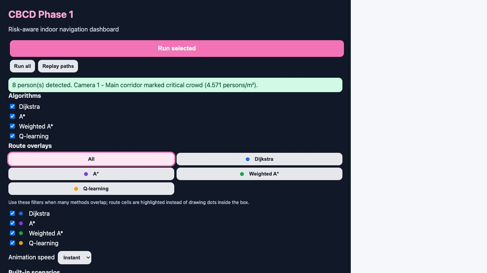
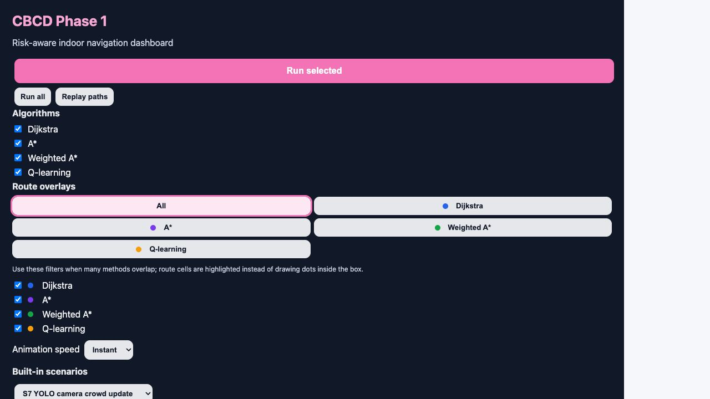

# Stage D Demo Evidence - YOLO Camera Crowd Update

Date captured: 2026-06-26

## Purpose

This evidence pack demonstrates the Stage D prototype flow:

`camera / iPhone media -> YOLO person detection -> mapped camera coverage -> crowd density -> route-grid crowd cells -> risk-aware route recommendation`

The demo uses the built-in scenario **S7 YOLO camera crowd update**. In this scenario, the shortest corridor is covered by a camera label and marked as a critical crowd zone after YOLO detection. The route algorithms then compare whether they continue through the crowded corridor or choose a safer detour.

## Visual Evidence

### 1. Camera Coverage Map



Evidence shown:

- Built-in scenario loaded: `S7 YOLO camera crowd update`.
- Camera label: `Camera 1 - Main corridor`.
- Coverage: 7 grid cells.
- Coverage percentage: 11.7% of walkable cells.
- Area: 1.75 m2.
- Existing mapped crowd level: critical / intensity 3.

### 2. YOLO Sample Video Detection



Evidence shown:

- Sample video: `big_city_life_people.webm`.
- Model: `ultralytics-yolov8n.pt-person`.
- People detected in peak frame: 8.
- Frames analyzed: 12.
- Peak frame index: 120.
- Average confidence: 0.71.
- Density: 4.571 persons/m2.
- Crowd level: critical.

### 3. Route Comparison After Crowd Update



Evidence shown:

- Dijkstra and A* select the shorter path through the crowd zone.
- Weighted A* selects a longer but crowd-free route.
- Weighted A* achieves 100% crowd reduction compared with Dijkstra.

## Numeric Result

Backend comparison for `S7 YOLO camera crowd update`:

| Algorithm | Distance | Crowd score | Total cost | Crowd reduction vs Dijkstra | Nodes expanded |
|---|---:|---:|---:|---:|---:|
| Dijkstra | 25 | 21.0 | 88.0 | 0.0% | 51 |
| A* | 25 | 21.0 | 88.0 | 0.0% | 26 |
| Weighted A* | 35 | 0.0 | 35.0 | 100.0% | 46 |
| Q-learning | 25 | 21.0 | 88.0 | 0.0% | 26 |

Interpretation:

Weighted A* accepts a 10-step longer route because it avoids the YOLO-derived crowd zone. This supports the prototype claim that the shortest route is not always the safest or most suitable route in a crowded indoor environment.

## Sample Media

Local demo media:

- Browser-served sample photo: `frontend/public/vision_samples/ultralytics_bus_people.jpg`
- Browser-served sample video: `frontend/public/vision_samples/big_city_life_people.webm`
- Scratch/download copies: `incoming/vision_examples/`

Original sources:

- Ultralytics sample image: `https://ultralytics.com/images/bus.jpg`
- Wikimedia Commons video: `https://commons.wikimedia.org/wiki/File:Big_City_Life.webm`

The media folders are ignored by git to avoid committing large demo assets.

## Reproduction Steps

Run backend:

```bash
cd /Users/123ang/Desktop/Websites/cbcd/backend
PYTHONPATH=. .venv/bin/uvicorn main:app --host 127.0.0.1 --port 8001
```

Run frontend:

```bash
cd /Users/123ang/Desktop/Websites/cbcd/frontend
npm run dev -- --host 127.0.0.1 --port 5173
```

Manual demo:

1. Open `http://127.0.0.1:5173/`.
2. Load built-in scenario `S7 YOLO camera crowd update`.
3. Open the `Camera Vision` tab.
4. Click `Sample video`.
5. Confirm YOLO detects 8 people and marks the mapped coverage as critical crowd.
6. Click `Run selected`.
7. Confirm Weighted A* recommends the lowest-cost route and avoids the camera-derived crowd cells.

Backend-only check:

```bash
cd /Users/123ang/Desktop/Websites/cbcd/backend
PYTHONPATH=. .venv/bin/python - <<'PY'
import json
from pathlib import Path
from main import compare_algorithms
from utils.models import ScenarioRequest

scenario = next(
    s for s in json.loads(Path("data/scenarios.json").read_text())
    if s["name"] == "S7 YOLO camera crowd update"
)

for result in compare_algorithms(ScenarioRequest(**scenario)):
    print(result.algorithm, result.distance, result.crowd_score, result.total_cost, result.crowd_reduction_pct)
PY
```

## Research Use

This demo supports the framework argument that crowd perception should not stop at people detection. The useful decision-support pipeline is:

1. Detect visible people from camera/iPhone media.
2. Convert the count into density using mapped camera coverage area.
3. Translate density into route-grid crowd intensity.
4. Recalculate evacuation routes.
5. Explain why a safer route is selected.

The evidence is strongest for low-to-moderate density scenes where individual people are visible. Dense occlusion may require a specialized crowd-density model in later work.

## Patent / Disclosure Note

This evidence should be treated as internal development material until patent-filing advice is clear. Public disclosure should avoid revealing any proprietary ASNA/SDSOS optimization logic, exact scoring variations intended for patent claims, or unpublished system architecture beyond what is needed for supervisor review.
