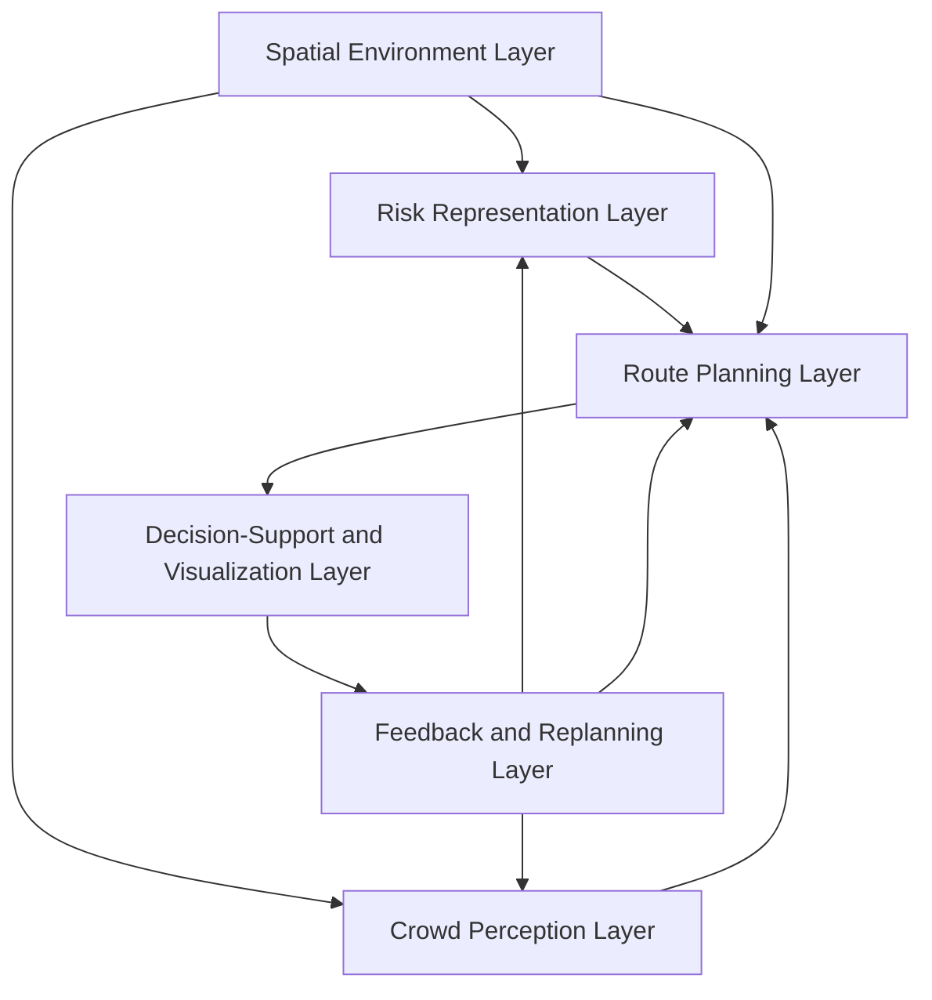

# A Conceptual Framework for Camera-Assisted Risk-Aware Indoor Navigation and Crowd-Informed Decision Support in Confined Environments

**Author:** Jin Sheng Ang  
**Draft type:** Stage 1 conceptual framework article  
**Status:** Full Markdown draft for review  

---

## Abstract

Indoor navigation in confined environments requires more than shortest-path routing because the shortest route may pass through crowded areas, hazardous zones, blocked corridors, or exits with limited accessibility. Existing studies have explored indoor evacuation routing, risk-aware path planning, crowd detection, crowd counting, and decision-support systems. However, these research areas are often treated separately. Route-planning studies commonly assume that risk and crowd information are already available, while camera-based crowd detection studies usually focus on monitoring or people counting without connecting the detected crowd condition to route recommendation. This paper proposes a conceptual framework for camera-assisted risk-aware indoor navigation and crowd-informed decision support in confined environments. The proposed framework integrates six main layers: spatial environment modelling, risk representation, crowd perception, route planning, decision-support visualization, and feedback-based replanning. The framework is developed using a literature-based design science approach and demonstrated through scenario walkthroughs involving high-risk corridors, crowded exits, and dynamic risk updates. The main contribution of this paper is the integration of camera-based crowd perception with risk-aware route planning and explainable decision support. The proposed framework provides a foundation for future prototype development, simulation-based evaluation, and real-world camera-based crowd detection integration.

**Keywords:** indoor navigation; risk-aware routing; crowd detection; decision support; confined environment; conceptual framework; camera-assisted navigation

---

## 1. Introduction

Indoor navigation has become an important research area because people frequently move through complex built environments such as campuses, hospitals, shopping malls, transport terminals, event halls, libraries, and office buildings. In these environments, users may need guidance to reach a destination, locate an exit, avoid restricted areas, or move safely during abnormal situations. Conventional navigation systems usually aim to recommend the shortest path or the fastest path. This approach is useful in normal conditions, but it may not be sufficient in confined or crowded environments where route safety can change due to congestion, smoke, blocked corridors, fire hazards, or inaccessible exits.

The shortest route is not always the safest route. A route with fewer steps may pass through a crowded corridor, a high-risk zone, or an exit that is already congested. In contrast, a slightly longer route may provide lower exposure to hazards and better movement safety. Therefore, indoor navigation in confined environments should consider not only geometric distance, but also risk level, crowd density, blockage condition, and exit accessibility. This creates a need for risk-aware and crowd-informed route recommendation.

Previous studies have shown that indoor evacuation routing can be improved by considering fire semantics, smoke distribution, route accessibility, and dynamic environmental changes. Other studies have demonstrated that camera-based crowd detection and deep learning crowd-counting methods can estimate crowd density in real time. However, the two research directions are commonly developed separately. Evacuation routing studies often focus on path computation and risk modelling, while crowd detection studies mainly focus on detecting or counting people from camera images. Limited studies provide an integrated framework that connects camera-based crowd perception directly with risk-aware route planning and decision-support visualization.

This separation creates a practical research gap. A camera system may detect crowd congestion, but if the output is not translated into route cost or decision-support information, the detection result remains only a monitoring function. Similarly, a route-planning system may calculate a path, but if it does not receive updated crowd or hazard information, it may recommend a route that is no longer suitable. Therefore, there is a need for a conceptual framework that links spatial environment modelling, risk representation, camera-based crowd perception, adaptive route planning, decision-support visualization, and feedback-based replanning.

This paper proposes a conceptual framework for camera-assisted risk-aware indoor navigation and crowd-informed decision support in confined environments. The framework is designed to support safer route recommendation by integrating static spatial layout, dynamic risk conditions, camera-based crowd information, route planning algorithms, and explainable visualization. The framework is not presented as a certified evacuation system. Instead, it is proposed as a decision-support structure that can guide future prototype development and simulation-based evaluation.

The objectives of this paper are:

1. To review existing studies on indoor navigation, evacuation routing, risk-aware path planning, crowd detection, and decision-support systems.
2. To identify the research gaps and design requirements for integrating crowd sensing with risk-aware indoor navigation.
3. To propose a conceptual framework that integrates spatial environment modelling, risk representation, crowd perception, route planning, decision support, and feedback-based replanning.

The research questions are:

1. What are the existing approaches used in indoor navigation, evacuation routing, risk-aware path planning, crowd detection, and decision-support systems?
2. What research gaps and design requirements exist for integrating crowd sensing with risk-aware indoor navigation?
3. How can a conceptual framework be designed to integrate spatial environment modelling, risk representation, crowd perception, route planning, decision support, and feedback-based replanning?

The remainder of this paper is structured as follows. Section 2 reviews related literature. Section 3 explains the research methodology. Section 4 presents the proposed conceptual framework. Section 5 demonstrates the framework through scenario walkthroughs. Section 6 presents a proposed validation plan. Section 7 discusses the contribution, implications, and limitations. Section 8 concludes the paper and outlines future work.

---

## 2. Literature Review

### 2.1 Indoor Navigation and Evacuation Routing

Indoor navigation refers to the process of guiding users from one indoor location to another using spatial information, route-planning algorithms, and positioning or environmental data. Unlike outdoor navigation, indoor navigation is more difficult because Global Navigation Satellite System signals are weak or unavailable inside buildings. Indoor environments also contain complex spatial constraints such as walls, rooms, corridors, staircases, elevators, exits, obstacles, and restricted areas.

Traditional indoor navigation approaches commonly rely on graph-based routing. In such approaches, the indoor environment is represented as nodes and edges, and algorithms such as Dijkstra or A* are used to identify the shortest or least-cost path. Dijkstra’s algorithm is widely used because it guarantees the shortest path when all edge weights are non-negative. A* improves search efficiency by using a heuristic function to guide the search toward the destination. These algorithms are suitable for normal navigation, but their effectiveness depends on how the route cost is defined.

If the route cost only represents distance, the recommended path may not be suitable in emergency or crowded situations. For example, a short corridor may be blocked by smoke, occupied by many people, or located near a high-risk area. In such cases, a distance-only algorithm may still choose the risky corridor because it has the smallest geometric cost. Therefore, indoor evacuation routing requires additional semantic and environmental information.

Studies on fire evacuation routing have highlighted this limitation. Indoor evacuation systems may need to consider fire location, smoke concentration, path accessibility, structural damage, visibility, and exit availability. Three-dimensional indoor fire evacuation routing research shows that traditional geometric routing can generate unsafe routes when fire-related semantics are ignored. Similarly, dynamic evacuation studies demonstrate that smoke and crowd congestion can change route suitability over time. These findings support the argument that indoor navigation should move beyond shortest-path routing toward risk-aware route recommendation.

### 2.2 Risk-Aware Path Planning

Risk-aware path planning considers environmental hazards and movement constraints when recommending a route. Instead of treating all walkable areas equally, risk-aware routing assigns additional cost to unsafe or less desirable areas. These risks may include fire, smoke, crowd congestion, blocked corridors, low visibility, structural damage, slippery surfaces, or inaccessible exits.

The main idea of risk-aware path planning is that a safer route may be longer but more appropriate. For example, a path that avoids a high-risk corridor may have more steps, but it can reduce exposure to danger. A route cost function can be designed to combine distance with risk factors such as hazard intensity, crowd density, and blockage penalty. The final route is then selected based on total cost rather than distance alone.

Dynamic risk-aware studies have proposed route optimization methods that update path decisions when environmental conditions change. For example, smoke concentration or congestion information can be incorporated into the route cost function. If smoke spreads or a corridor becomes congested, the system recalculates the route and recommends an alternative path. This is important because indoor safety conditions are not static during emergencies or high-density events.

Risk-aware path planning is therefore suitable for confined environments where movement safety depends on more than distance. However, many existing systems focus mainly on hazard modelling or algorithmic route optimization. They do not always provide a complete decision-support structure that explains the reason for a route recommendation or connects live crowd perception to route planning. This creates an opportunity to develop a framework that integrates risk representation with crowd perception and visualization.

### 2.3 Crowd Detection and Crowd Counting

Crowd detection and crowd counting are important for public safety, smart buildings, event management, and emergency response. In indoor environments, camera-based systems can be used to detect people, estimate crowd density, monitor pedestrian flow, and identify congested areas. Recent computer vision studies show that deep learning methods, especially YOLO-based object detection models, can detect people in image and video streams with promising accuracy and real-time performance.

YOLO-based detection is useful because it can identify humans from video frames and estimate the number of people in a specific area. In moderately crowded environments, individual person detection can provide a direct crowd count. In highly dense environments, density estimation methods may be more suitable because individual bodies may overlap or become partially occluded. Crowd-counting surveys show that deep learning density estimation is useful for estimating crowd levels under scale variation, perspective changes, and occlusion.

For indoor navigation, the value of crowd detection is not only in counting people. The crowd information should be converted into a decision-support input. For example, a camera may detect high crowd density near Exit 1. If this result is translated into a crowd-risk score, the route-planning layer can reduce the preference for Exit 1 and recommend Exit 2 instead. Without this integration, crowd detection remains only a monitoring function and does not directly improve route recommendation.

Therefore, this paper treats camera-based crowd perception as one layer in a larger navigation and decision-support framework. The crowd perception layer receives video input, detects or estimates crowd density, classifies the crowd level, and passes the crowd score to the route-planning layer. This enables crowd-informed route recommendation.

### 2.4 Indoor Localization and User Guidance

Indoor localization is another important component of practical indoor navigation. A navigation system needs to know the user’s current position before it can recommend a route. However, indoor localization remains challenging because GPS signals are unreliable indoors. Existing studies have explored Wi-Fi, Bluetooth, inertial sensors, cameras, LiDAR, radio signals, and multimodal machine learning approaches.

Multimodal indoor localization reviews show that no single indoor positioning method is universally dominant. Combining multiple data sources can improve accuracy, but it also increases system complexity. In the context of this paper, indoor localization is recognized as an important future component. The proposed conceptual framework assumes that a user location or start point is available through manual selection, sensor input, or future localization integration.

User guidance also requires the route recommendation to be understandable. In emergency or congested settings, users and decision-makers may need to know why a route is recommended. A route explanation may include distance, risk score, crowd score, blocked areas, and exit accessibility. This supports trust and transparency. For this reason, the proposed framework includes a decision-support and visualization layer.

### 2.5 Agent-Based Simulation and Evacuation Modelling

Agent-based simulation is commonly used to study pedestrian evacuation and crowd movement. In agent-based models, each pedestrian can be represented as an agent with behaviour, movement rules, speed, destination, and decision-making logic. This approach is useful because crowd behaviour can produce complex patterns such as bottlenecks, congestion, lane formation, and exit competition.

Systematic reviews of agent-based evacuation simulation show that these models can represent heterogeneous evacuees and emergent crowd behaviour. However, validation remains a challenge because real evacuation data are difficult to obtain. Models may also depend on simplified assumptions, modeller bias, and limited behavioural evidence. Therefore, simulation should be used carefully and transparently.

For the proposed framework, agent-based simulation is relevant as a future evaluation method. The conceptual framework can first define the relationship between spatial layout, risk, crowd perception, route planning, and decision support. Later, simulation can be used to test how different route recommendations affect pedestrian movement under controlled scenarios.

### 2.6 Design Science and Conceptual Framework Development

Design science research is suitable for studies that create and evaluate artifacts such as models, methods, frameworks, systems, and prototypes. In information systems research, design science focuses on developing useful solutions for relevant problems. A conceptual framework can be considered a design artifact when it organizes problem knowledge, defines components, explains relationships, and supports future implementation.

The Design Science Research Methodology includes activities such as problem identification, objective definition, design and development, demonstration, evaluation, and communication. This process is appropriate for this paper because the study aims to propose a framework that addresses a practical decision-support problem. The current paper focuses mainly on problem identification, objective definition, conceptual design, and scenario-based demonstration. Future work will extend the framework into prototype development and empirical evaluation.

### 2.7 Research Gap Summary

The reviewed literature shows that indoor evacuation routing, risk-aware path planning, camera-based crowd detection, indoor localization, and decision-support systems have each received research attention. However, these areas are commonly studied separately. Route-planning studies often focus on shortest path, fire semantics, smoke risk, congestion, or algorithm performance. Crowd detection studies often focus on detecting people, counting people, or estimating density. Decision-support studies focus on visualization or user guidance.

The gap is the lack of an integrated framework that connects camera-based crowd perception with risk-aware indoor route planning and explainable decision support. In other words, crowd detection output should not stop at monitoring. It should be transformed into crowd-risk information that influences route recommendation. Similarly, risk-aware route planning should not stop at algorithm output. It should provide explainable visualization for users and decision-makers.

Table 1 summarizes the literature gap.

**Table 1. Literature comparison and research gap**

| Research stream | Main focus | Strength | Limitation for this study |
|---|---|---|---|
| Indoor navigation | Route guidance inside buildings | Provides graph-based routing methods | Often emphasizes distance or travel efficiency |
| Fire evacuation routing | Hazard-aware escape route planning | Considers smoke, fire, accessibility, and dynamic risk | May not integrate camera-based crowd perception |
| Risk-aware path planning | Route cost based on risk factors | Supports safer route selection | Often focuses on algorithm design rather than decision-support visualization |
| Crowd detection | Detects or counts people from images/videos | Provides real-time crowd information | Often stops at monitoring and does not affect navigation decisions |
| Crowd counting and density estimation | Estimates crowd density in dense scenes | Useful under occlusion and high-density conditions | Requires integration with route-cost models |
| Decision-support systems | Visualizes recommendations and supports decisions | Improves understanding and transparency | Needs updated risk and crowd inputs |
| Proposed framework | Integrates spatial, risk, crowd, routing, visualization, and feedback layers | Connects crowd sensing to route recommendation | Requires future implementation and validation |

---

## 3. Research Methodology

This study adopts a literature-based design science research approach to develop a conceptual framework for camera-assisted risk-aware indoor navigation and crowd-informed decision support. Design science is appropriate because the study aims to create an artifact that addresses a practical problem: how to support safer and more explainable indoor route recommendation in confined environments.

The methodology consists of four main stages.

First, the problem is identified from the literature. Existing studies show that shortest-path routing may be insufficient in hazardous or crowded indoor environments. The literature also shows that crowd detection and route planning are often treated separately. This motivates the need for an integrated framework.

Second, the objectives of the solution are defined. The framework should be able to represent indoor space, model risk factors, receive crowd information, compute routes using risk-aware logic, visualize the decision, and update recommendations when conditions change.

Third, the conceptual framework is designed. The framework is organized into six layers: spatial environment, risk representation, crowd perception, route planning, decision-support visualization, and feedback-based replanning. Each layer has specific inputs, processes, and outputs.

Fourth, the framework is demonstrated through scenario walkthroughs. The scenarios are used to show how the framework can respond to high-risk corridors, crowded exits, and dynamic condition updates. Since this is a conceptual framework paper, the scenarios are not presented as final empirical validation. They are used to explain framework logic and prepare for future prototype implementation.

Table 2 maps the design science stages to this study.

**Table 2. Design science application in this study**

| Design science stage | Application in this paper |
|---|---|
| Problem identification | Shortest-path navigation may be unsafe in crowded or hazardous confined environments |
| Objective definition | Develop an integrated framework for risk-aware and crowd-informed route recommendation |
| Design and development | Propose six framework layers and define their relationships |
| Demonstration | Use scenario walkthroughs to show framework behaviour |
| Evaluation | Propose expert review and future simulation-based validation |
| Communication | Present the conceptual framework as a research article |

---

## 4. Proposed Conceptual Framework

### 4.1 Framework Overview

The proposed framework integrates indoor spatial modelling, risk representation, camera-based crowd perception, route planning, decision-support visualization, and feedback-based replanning. The purpose is to support safer and more explainable indoor navigation in confined environments.

The framework is organized into six layers:

1. Spatial Environment Layer
2. Risk Representation Layer
3. Crowd Perception Layer
4. Route Planning Layer
5. Decision-Support and Visualization Layer
6. Feedback and Replanning Layer

The layers are connected because route recommendation depends on multiple types of information. The spatial environment layer provides the indoor layout. The risk representation layer identifies hazards and unsafe areas. The crowd perception layer estimates crowd density from camera input. The route planning layer combines spatial, risk, and crowd information to generate a route. The decision-support layer explains and visualizes the route. The feedback and replanning layer updates the route when conditions change.



### 4.2 Layer 1: Spatial Environment Layer

The spatial environment layer represents the physical indoor layout. It includes corridors, rooms, walls, exits, obstacles, restricted areas, staircases, and movement constraints. This layer provides the basic structure required for route planning. Without a spatial model, the system cannot determine which areas are walkable, which areas are blocked, and where exits are located.

The indoor environment can be represented using a graph, grid, or semantic indoor model. In a graph-based representation, important locations are represented as nodes, and walkable connections are represented as edges. In a grid-based representation, the indoor floor plan is divided into cells, and each cell is assigned a type such as walkable, wall, risk, crowd, start, or exit. A semantic indoor model may include more detailed information such as room function, door accessibility, corridor width, and floor level.

The output of this layer is an indoor map that can be used by other layers. The risk representation layer uses the map to attach risk values to locations. The route planning layer uses the map to compute valid routes. The decision-support layer uses the map to visualize the recommended route.

### 4.3 Layer 2: Risk Representation Layer

The risk representation layer transforms environmental hazards into route-cost information. Instead of treating every walkable area as equally safe, this layer assigns risk values to locations. Risk factors may include fire, smoke, blocked corridors, high-risk zones, low visibility, structural damage, or inaccessible exits.

In the proposed framework, risk can be represented as a score. A low-risk area receives a small or zero additional cost, while a high-risk area receives a larger cost. The risk score can be static or dynamic. A static risk score may be assigned based on known building conditions, restricted areas, or historical hazard information. A dynamic risk score may be updated based on sensor input, camera detection, staff reports, or simulation output.

This layer supports risk-aware route planning. A route that passes through a high-risk zone will have a higher total cost, making it less likely to be selected unless no safer alternative exists. The purpose is not to guarantee safety, but to support a more informed decision compared with distance-only routing.

### 4.4 Layer 3: Crowd Perception Layer

The crowd perception layer provides dynamic crowd information using camera-based detection or density estimation. Cameras installed in indoor environments can capture video streams from corridors, entrances, exits, or gathering areas. Computer vision models can then detect people, count individuals, estimate density, and classify crowd levels.

A YOLO-based model can be used for human detection when people are visible as individual objects. In dense scenes where people overlap, density estimation methods may be used to estimate crowd concentration. The output of this layer can be converted into crowd categories such as low, medium, and high density. These categories can then be translated into crowd-risk scores for route planning.

The key contribution of this layer is that crowd detection is not treated as a separate monitoring module. Instead, its output becomes part of the navigation decision. For example, if the system detects high crowd density near an exit, the crowd score for that area increases. The route planning layer may then recommend an alternative exit with lower crowd exposure.

### 4.5 Layer 4: Route Planning Layer

The route planning layer receives spatial, risk, and crowd information and generates a recommended path. Conventional route planning may use algorithms such as Dijkstra or A* to find the shortest route. In the proposed framework, the route cost is extended to include distance, risk exposure, crowd exposure, blockage, and exit accessibility.

A simplified route-cost model can be expressed as:

```text
route_cost = distance_cost + risk_cost + crowd_cost + blockage_cost + exit_accessibility_cost
```

At cell or edge level, the cost may be represented as:

```text
cell_cost = α(distance) + β(crowd) + γ(risk) + δ(blockage)
```

where α, β, γ, and δ are weighting parameters. Higher weights indicate that the factor has greater influence on route selection. For example, if risk avoidance is more important than distance, the risk weight can be increased.

This route planning layer can support different algorithms. Dijkstra and A* can be used as baseline algorithms. Weighted A* can be used to combine heuristic guidance with risk-aware cost. Reinforcement learning or other intelligent algorithms can be explored in future work. The important point is that the algorithm should not only optimize distance, but also consider the route’s safety and crowd condition.

### 4.6 Layer 5: Decision-Support and Visualization Layer

The decision-support and visualization layer presents the route recommendation in an understandable way. It should show not only the selected route, but also the reason why the route is recommended. This is important because users and decision-makers may not trust a route recommendation if the system does not explain the decision.

The visualization may include an indoor map, route line, start point, exits, risk zones, crowd zones, blocked areas, and alternative routes. The decision-support panel may show route distance, risk score, crowd score, total cost, computation time, selected exit, and explanation text. For example, the system may explain that a longer route was selected because the shorter route passes through a high-risk corridor.

This layer is especially important in confined environments because route decisions may involve trade-offs. A route may be longer but safer. Another route may be shorter but more crowded. The decision-support layer helps users understand these trade-offs.

### 4.7 Layer 6: Feedback and Replanning Layer

The feedback and replanning layer enables the framework to respond to changing conditions. Indoor conditions can change quickly. A corridor that is safe at one moment may become crowded later. An exit may become blocked. A hazard may spread. Therefore, route recommendation should be updated when new information becomes available.

This layer receives updated crowd detection results, updated risk information, or user feedback. The updated information is passed back to the risk representation layer, crowd perception layer, and route planning layer. The route is then recalculated if necessary.

Feedback-based replanning is one of the main differences between static route guidance and dynamic decision support. It allows the system to adapt to new conditions and maintain a more current recommendation.

### 4.8 Framework Layer Summary

**Table 3. Framework layer summary**

| Layer | Main function | Input | Process | Output |
|---|---|---|---|---|
| Spatial Environment | Represents indoor layout | Floor plan, walls, corridors, exits | Convert building structure into route-planning model | Indoor map or graph |
| Risk Representation | Represents hazards and unsafe areas | Fire, smoke, blockage, restricted areas | Assign risk values to locations | Risk map or risk score |
| Crowd Perception | Detects or estimates crowd level | Camera/video stream | Person detection, crowd counting, density estimation | Crowd score or density level |
| Route Planning | Computes route recommendation | Map, risk score, crowd score, user location, destination | Apply route-planning algorithm with weighted cost | Recommended route |
| Decision Support | Explains and visualizes recommendation | Route results and scores | Display map, route, metrics, and explanation | Dashboard or user interface |
| Feedback and Replanning | Updates route when condition changes | New crowd/risk data, user feedback | Update scores and recalculate route | Revised route recommendation |

---

## 5. Scenario Walkthrough

Since this paper proposes a conceptual framework, scenario walkthroughs are used to demonstrate how the framework can operate. The scenarios are designed to show how crowd and risk information influence route decisions.

### 5.1 Scenario 1: High-Risk Corridor

In this scenario, a user starts from Room A and needs to reach an exit. There are two possible routes. Route 1 is shorter but passes through a corridor marked as high risk. Route 2 is longer but avoids the risky corridor.

In a distance-only system, Route 1 may be selected because it has fewer steps. In the proposed framework, the risk representation layer assigns a higher risk score to the high-risk corridor. The route planning layer combines distance and risk score. Although Route 2 is longer, its total route cost may be lower because it avoids the high-risk area. Therefore, the system recommends Route 2.

This scenario shows why shortest path may not be the safest path. It also demonstrates how risk representation can influence route recommendation.

### 5.2 Scenario 2: Crowded Exit

In this scenario, two exits are available. Exit 1 is closer to the user, but camera input detects high crowd density near Exit 1. Exit 2 is farther but less crowded.

The crowd perception layer processes camera input and classifies the crowd level near Exit 1 as high. This crowd level is converted into a crowd-risk score. The route planning layer then includes crowd exposure in the route cost. Even though Exit 1 is closer, its high crowd score increases the total cost. The framework may recommend Exit 2 because it provides lower crowd exposure.

This scenario shows how camera-based crowd detection can support navigation decisions. The crowd detection result is not only displayed; it directly influences route recommendation.

### 5.3 Scenario 3: Dynamic Risk Update

In this scenario, the system initially recommends Route 1 because it has acceptable distance, low risk, and low crowd exposure. After several minutes, the crowd perception layer detects increasing congestion along Route 1, or the risk representation layer receives information that part of the route is blocked.

The feedback and replanning layer updates the crowd or risk score and sends the new information to the route planning layer. The system recalculates the route. If Route 1 is no longer suitable, the framework recommends an alternative route.

This scenario demonstrates the importance of feedback-based replanning. Indoor conditions are dynamic, and route decisions should be updated when new data are available.

### 5.4 Scenario Summary

**Table 4. Scenario walkthrough summary**

| Scenario | Condition | Distance-only decision | Framework decision | Explanation |
|---|---|---|---|---|
| High-risk corridor | Shorter route passes through high-risk area | Select shorter route | Select longer safer route | Risk score increases cost of dangerous corridor |
| Crowded exit | Nearest exit has high crowd density | Select nearest exit | Recommend less crowded exit | Crowd score affects route cost |
| Dynamic update | Route condition changes after recommendation | Continue original route | Recalculate route | Feedback layer updates risk/crowd information |

---

## 6. Proposed Validation Plan

A conceptual framework should be evaluated to ensure that it is clear, complete, feasible, and useful. Since this paper presents a Stage 1 conceptual framework, the proposed validation approach combines expert review and scenario walkthrough.

### 6.1 Expert Review

Expert review can be conducted with three to five experts in areas such as indoor navigation, evacuation planning, computer vision, decision-support systems, or safety management. The experts can review the framework diagram, layer descriptions, scenario walkthroughs, and design requirements.

The purpose of expert review is to identify whether the framework is understandable, whether important components are missing, and whether the proposed integration is feasible.

**Table 5. Expert review checklist**

| Evaluation item | Review question |
|---|---|
| Clarity | Are the framework layers clearly explained? |
| Completeness | Are important components missing from the framework? |
| Practicality | Can the framework be applied to real confined indoor environments? |
| Relevance | Is crowd-informed routing useful for indoor navigation and safety decision support? |
| Feasibility | Can the framework be implemented using current camera, routing, and dashboard technologies? |
| Decision support | Does the visualization layer provide useful explanation for users or decision-makers? |
| Replanning | Is the feedback loop suitable for dynamic indoor conditions? |

### 6.2 Scenario-Based Demonstration

Scenario walkthroughs provide an early demonstration of framework logic. The scenarios can be reviewed by experts to determine whether the framework behaves reasonably under different conditions. Future work can convert these scenarios into simulation experiments using a prototype.

### 6.3 Future Prototype Evaluation

Future validation should include prototype implementation and quantitative evaluation. A simulation environment can be developed to compare distance-only routing and risk-aware routing. Evaluation metrics may include route distance, risk exposure, crowd exposure, total route cost, computation time, nodes expanded, route success, and number of replanning events.

**Table 6. Future evaluation metrics**

| Metric | Meaning | Preferred direction |
|---|---|---|
| Distance | Number of steps or travel length | Lower, if safety is not reduced |
| Risk score | Exposure to hazard or risk zones | Lower |
| Crowd score | Exposure to crowded areas | Lower |
| Total cost | Weighted combination of route factors | Lower |
| Computation time | Time required to compute route | Lower |
| Nodes expanded | Search effort of routing algorithm | Lower |
| Route success | Whether the route reaches a valid destination or exit | Higher |
| Replanning frequency | Number of route updates caused by changing conditions | Context dependent |

---

## 7. Discussion

### 7.1 Addressing the Research Gap

The proposed framework addresses the research gap by connecting camera-based crowd perception with risk-aware route planning and decision-support visualization. Existing route-planning studies provide useful methods for computing safer routes, but they may not directly integrate live crowd detection. Existing crowd detection studies can detect or count people, but their outputs may not be connected to route recommendation. The proposed framework bridges these areas by converting crowd information into route-planning input.

This integration is important because crowd condition is a dynamic risk factor. A route that is safe under low crowd density may become less suitable when congestion increases. By incorporating crowd scores into route cost, the framework can recommend alternatives that reduce crowd exposure.

### 7.2 Practical Usefulness

The framework can support several practical use cases. In a shopping mall, it can help guide people away from overcrowded exits during an event. In a university campus building, it can support safer movement during emergency drills. In a hospital, it can help identify routes that avoid blocked or congested corridors. In a transport terminal, it can support crowd-informed routing during peak hours.

The decision-support layer is also useful for building managers and safety officers. Instead of only displaying a route, the system can explain why the route is recommended. This explanation can include risk score, crowd score, blocked areas, and exit accessibility. Such transparency supports better decision-making.

### 7.3 Conceptual Contribution

The main conceptual contribution of this paper is the six-layer integration model. The proposed framework organizes the required components for camera-assisted risk-aware indoor navigation. It shows how spatial modelling, risk representation, crowd perception, route planning, visualization, and feedback-based replanning can work together.

The framework also clarifies the role of camera-based crowd detection. In this paper, crowd detection is not the final objective. Instead, it is a data source that supports route recommendation. This distinction is important because many computer vision systems stop at detection accuracy, while decision-support systems require detected information to be converted into actionable decisions.

### 7.4 Implementation Implications

To implement the framework, several technical components are required. First, the indoor environment must be modelled using a graph, grid, or semantic map. Second, risk and crowd values must be assigned to relevant locations. Third, a route-planning algorithm must compute routes using weighted cost. Fourth, a dashboard or user interface must present the route and explanation. Fifth, the system must update route recommendations when new risk or crowd information arrives.

The framework can be implemented gradually. A first prototype can use a grid-based simulation with manually assigned risk and crowd values. A second prototype can integrate camera-based crowd detection to update crowd scores automatically. A later prototype can include indoor localization and real-time user guidance.

### 7.5 Limitations

This paper has several limitations. First, the framework is conceptual and has not yet been fully implemented in a real indoor environment. Second, the scenario walkthroughs demonstrate framework logic but do not provide empirical proof of safety improvement. Third, camera-based crowd detection may face practical challenges such as occlusion, lighting variation, camera placement, privacy requirements, and domain shift. Fourth, indoor localization is not fully addressed in this Stage 1 framework and should be developed in future work. Fifth, route recommendation should not be interpreted as certified emergency evacuation instruction without proper validation and compliance with safety regulations.

Despite these limitations, the framework provides a useful foundation for future development. It defines the components and relationships needed to integrate crowd perception with risk-aware navigation.

---

## 8. Conclusion and Future Work

In a nutshell, this paper proposed a conceptual framework for camera-assisted risk-aware indoor navigation and crowd-informed decision support in confined environments. The framework integrates six layers: spatial environment modelling, risk representation, crowd perception, route planning, decision-support visualization, and feedback-based replanning. The motivation for the framework is that shortest-path routing may not be sufficient when indoor environments contain hazards, blocked corridors, crowded exits, or changing risk conditions.

The proposed framework contributes by linking camera-based crowd detection with risk-aware route recommendation. It also emphasizes explainable decision support, where route recommendations are supported by information such as distance, risk score, crowd score, and route cost. Scenario walkthroughs show how the framework can avoid high-risk corridors, respond to crowded exits, and update routes when conditions change.

For future work, the framework should be implemented as a prototype and evaluated using simulation-based experiments. Future studies can compare Dijkstra, A*, Weighted A*, and learning-based route-planning methods under different risk and crowd scenarios. Camera-based crowd detection using YOLO or density estimation methods can be integrated to update crowd scores automatically. Expert review should also be conducted to evaluate framework clarity, completeness, feasibility, and practical usefulness. Eventually, the framework can be extended toward real-world indoor navigation and safety decision-support applications.

---

## References

> **Note for final submission:** Bibliographic details should be verified in Zotero/Google Scholar/Scopus before journal formatting. The list below is prepared from the current Stage 1 literature folder and should be cleaned into the target journal reference style later.

[1] H. Zhou et al., “Three-Dimensional Indoor Fire Evacuation Routing,” *ISPRS International Journal of Geo-Information*, vol. 9, no. 10, 2020.

[2] “Algorithmic Evaluation of Fire Evacuation Efficiency Under Dynamic Crowd and Smoke Conditions,” 2026.

[3] “Assistive Mobile Application for Fire Emergency Evacuation of Visually Impaired People,” 2026.

[4] “Multimodal Image-Based Indoor Localization with Machine Learning—A Systematic Review,” *Sensors*, 2024.

[5] “Dynamic Risk Perception-Based Evacuation Path Optimization Framework in Metro Fire Scenarios,” preprint, 2025.

[6] “Crowd Detection: Leveraging YOLO for Human Recognition,” 2025.

[7] “Dense-Stream YOLOv8n: A Lightweight Framework for Real-Time Crowd Monitoring in Smart Libraries,” *Scientific Reports*, 2025.

[8] “A Survey of Deep Learning Methods for Density Estimation and Crowd Counting,” 2024.

[9] “Agent-Based Simulation for Pedestrian Evacuation: A Systematic Literature Review,” 2024.

[10] A. R. Hevner, S. T. March, J. Park, and S. Ram, “Design Science in Information Systems Research,” *MIS Quarterly*, vol. 28, no. 1, pp. 75–105, 2004.

[11] K. Peffers, T. Tuunanen, M. A. Rothenberger, and S. Chatterjee, “A Design Science Research Methodology for Information Systems Research,” *Journal of Management Information Systems*, vol. 24, no. 3, pp. 45–77, 2007.

[12] M. J. Page et al., “The PRISMA 2020 Statement: An Updated Guideline for Reporting Systematic Reviews,” *BMJ*, 2021.
