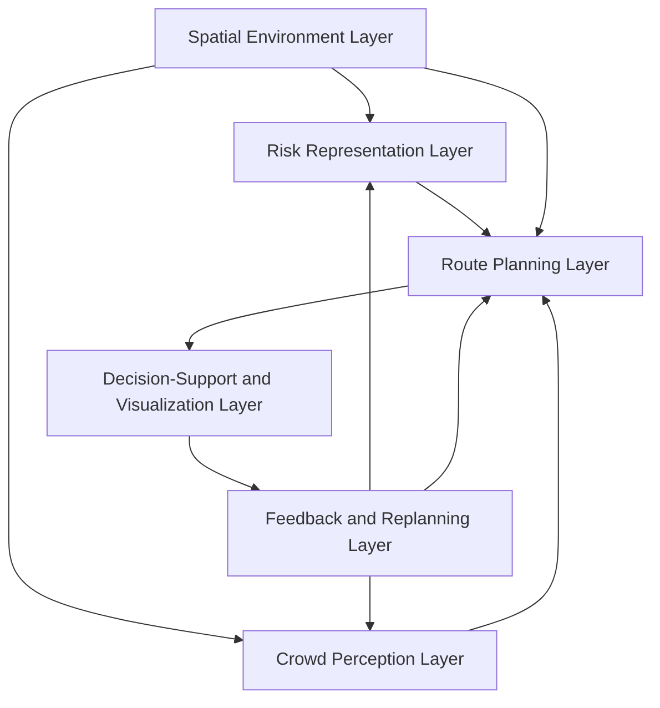

# A Conceptual Framework for Camera-Assisted Risk-Aware Indoor Navigation and Crowd-Informed Decision Support in Confined Environments

**Author:** Jin Sheng Ang  
**Draft type:** Full Markdown article draft following `ang_article` writing style  

---

## Abstract

Indoor navigation is important in many confined environments such as hospitals, campuses, shopping malls, transport terminals, libraries, and event halls. In these environments, the shortest path is not always the safest path. A short route may pass through a crowded corridor, a hazardous area, a blocked passage, or an exit that is not suitable to be used. Therefore, route recommendation should consider not only distance, but also risk, crowd density, blockage, and exit accessibility. Existing studies have discussed indoor navigation, evacuation routing, risk-aware path planning, crowd detection, and decision-support systems. However, most of these studies discuss the components separately. Crowd detection systems usually focus on monitoring or people counting, while indoor navigation systems usually focus on route calculation. This paper proposes a conceptual framework for camera-assisted risk-aware indoor navigation and crowd-informed decision support in confined environments. The proposed framework consists of six layers: spatial environment layer, risk representation layer, crowd perception layer, route planning layer, decision-support and visualization layer, and feedback and replanning layer. The framework is developed based on literature review and design science research approach. Scenario walkthroughs are used to explain how the framework can support safer route recommendation. The proposed framework can be used as a foundation for future prototype development, simulation-based evaluation, and integration with camera-based crowd detection.

**Keywords:** indoor navigation; risk-aware routing; crowd detection; decision support; confined environment; conceptual framework

---

## 1. Introduction

Indoor navigation has become an important research area because many people move inside complex buildings every day. Examples of these buildings include hospitals, universities, shopping malls, transport terminals, libraries, office buildings, factories, and event halls. In these confined environments, users may need guidance to move from one location to another location. During normal conditions, users may only need the shortest path. However, during crowded or risky situations, the shortest path may not be the most suitable path.

The common objective of navigation systems is to find the shortest route or fastest route. This objective is useful when the environment is stable and safe. However, in confined environments, several factors can affect the safety and suitability of a route. These factors include crowd density, blocked corridors, risk zones, fire, smoke, low visibility, unavailable exits, and obstacles. A path with a short distance may expose the user to higher risk. In contrast, a longer path may be safer because it avoids crowded or hazardous areas.

This situation shows that indoor navigation should not only depend on distance. A safer route recommendation should consider environmental risk and crowd condition. For example, if a corridor is crowded, the system should avoid recommending that corridor when an alternative route is available. If an exit is blocked, the system should recommend another reachable exit. If a risk zone appears on the shortest path, the system should calculate another path with lower risk exposure.

Existing studies have proposed many useful methods for indoor navigation and evacuation routing. Some studies use graph-based algorithms such as Dijkstra and A*. Other studies extend route planning by including fire, smoke, congestion, or route accessibility. At the same time, computer vision studies have shown that camera-based crowd detection can identify people and estimate crowd density. However, the problem is that these research areas are often separated. Crowd detection is usually used for monitoring, while route planning is used for navigation. Limited studies connect camera-based crowd information directly to risk-aware indoor route recommendation and decision-support visualization.

Therefore, this paper proposes a conceptual framework that integrates these components into one structure. The proposed framework links spatial environment modelling, risk representation, crowd perception, route planning, decision support, and feedback-based replanning. The main purpose of the framework is to support safer and more explainable route recommendation in confined indoor environments.

The motivation to develop this framework is based on three issues. First, shortest-path routing does not always represent the safest route. Second, crowd detection data should be used for decision making, not only for monitoring. Third, decision-makers need a clear explanation of why a route is recommended. Based on these issues, this paper proposes a framework that can be used as the foundation for future implementation.

The research objectives of this paper are as follows:

1. To review existing studies related to indoor navigation, evacuation routing, risk-aware path planning, crowd detection, and decision-support systems.
2. To identify the research gap and design requirements for integrating crowd sensing with risk-aware indoor navigation.
3. To propose a conceptual framework that integrates spatial environment modelling, risk representation, crowd perception, route planning, decision support, and feedback-based replanning.

The research questions are as follows:

1. What are the existing approaches used in indoor navigation, evacuation routing, risk-aware path planning, crowd detection, and decision-support systems?
2. What research gaps and design requirements exist for integrating crowd sensing with risk-aware indoor navigation?
3. How can a conceptual framework be designed to integrate spatial environment modelling, risk representation, crowd perception, route planning, decision support, and feedback-based replanning?

The rest of this paper is organized as follows. Section 2 discusses the related literature. Section 3 explains the research methodology. Section 4 presents the proposed conceptual framework. Section 5 explains the framework process flow. Section 6 presents scenario walkthroughs. Section 7 discusses validation plan. Section 8 presents discussion, limitation, and future work. Section 9 concludes the paper.

---

## 2. Literature Review

### 2.1 Indoor Navigation and Evacuation Routing

Indoor navigation is a process to guide users from one location to another location inside a building. It is different from outdoor navigation because GPS signal is usually weak or unavailable inside buildings. Indoor environments also have complex structures such as rooms, walls, doors, corridors, staircases, lifts, exits, and restricted areas. Therefore, indoor navigation needs a suitable indoor spatial model.

Many indoor navigation systems represent the building as a graph or grid. In a graph model, locations are represented as nodes, while corridors or walkable connections are represented as edges. In a grid model, the building layout is divided into cells. Each cell can be defined as walkable area, wall, blocked area, risk area, crowd area, starting point, or exit. After the environment is modelled, routing algorithms can be used to calculate the path.

Dijkstra and A* are two common algorithms used for path planning. Dijkstra algorithm can find the shortest path by exploring possible routes based on cost. A* algorithm improves the search process by using a heuristic function to guide the search toward the target location. These algorithms are useful as baseline methods because they are simple, clear, and widely used.

However, in emergency or risky situations, shortest-path routing may not be enough. A shortest path may pass through a fire area, smoke area, crowded corridor, or blocked exit. Studies on indoor fire evacuation routing show that geometric shortest paths can become unsafe when semantic and environmental information are ignored. Therefore, indoor evacuation routing should consider additional information such as fire location, smoke density, path accessibility, crowd congestion, and exit availability.

### 2.2 Risk-Aware Path Planning

Risk-aware path planning is an approach that considers risk factors during route calculation. In this approach, each route is not evaluated only by distance. The route is also evaluated based on safety-related factors. These factors may include hazard exposure, crowd density, blockage, smoke, fire, visibility, and exit accessibility.

The idea of risk-aware path planning is simple but important. A route with lower distance is not always better. If the route passes through a high-risk area, the total route cost should be increased. A longer route may become the better recommendation if it reduces risk exposure. Therefore, risk-aware route planning changes the objective from shortest path to safer and more suitable path.

Several studies have used dynamic risk information to support evacuation path planning. For example, smoke concentration and congestion information can be included in the route cost. When the risk condition changes, the route can be recalculated. This is important because indoor risk is not static. A corridor can become blocked, an exit can become crowded, or smoke can spread to another area.

For this paper, risk-aware path planning provides the main logic for route recommendation. The proposed framework uses risk information as part of the route cost. The framework does not only calculate distance, but also considers risk score, crowd score, blockage, and exit accessibility.

### 2.3 Crowd Detection and Crowd Counting

Crowd detection is a process to identify people or estimate the number of people in a specific area. It is useful for public safety, crowd management, smart building monitoring, and emergency response. In recent years, deep learning methods have improved the performance of computer vision systems. YOLO-based object detection models are commonly used for human detection because they can detect people from image or video frames.

Camera-based crowd detection can provide useful information for indoor navigation. For example, a camera near a corridor can detect whether the corridor is empty, moderately crowded, or highly crowded. A camera near an exit can identify whether the exit area is congested. This information can then be converted into a crowd level or crowd-risk score.

However, crowd detection alone is not enough. If the system only counts people and displays the number, it is still a monitoring system. To support navigation, the crowd information must be connected to route planning. For example, if the camera detects high crowd density on the shortest path, the route planning layer should increase the cost of that area. The system can then recommend another route with lower crowd exposure.

Crowd counting and density estimation studies also show that crowd analysis is difficult in dense scenes due to occlusion, different camera angles, lighting conditions, and scale variation. Therefore, future implementation should consider both object detection and density estimation. In the proposed framework, the crowd perception layer can use either person detection or density estimation depending on the environment.

### 2.4 Decision-Support System for Navigation

A decision-support system is a system that helps users or decision-makers understand information and make better decisions. In the context of indoor navigation, the system should not only output a path. It should also explain why the path is selected. This is important because route recommendation may involve trade-offs between distance, safety, crowd level, and exit accessibility.

For example, the system may recommend a longer path. Without explanation, the user may think the system is inefficient. However, if the system explains that the shorter path is crowded or risky, the recommendation becomes more understandable. Therefore, decision-support visualization is important for trust and usability.

A useful decision-support interface should show the indoor map, selected route, alternative route, risk zones, crowd zones, blocked paths, and exits. It should also show route metrics such as distance, risk score, crowd score, total cost, and computation time. These outputs can help users and building managers understand the reason behind the recommendation.

### 2.5 Design Science Research

Design science research is suitable for developing an artifact such as model, method, framework, system, or prototype. It focuses on solving practical problems through the design and evaluation of useful artifacts. Since this paper proposes a conceptual framework for indoor navigation decision support, design science research is suitable as the methodology foundation.

The design science process normally includes problem identification, objective definition, design and development, demonstration, evaluation, and communication. This paper focuses on the conceptual framework development stage. The framework is developed based on literature review and demonstrated using scenario walkthroughs. Future work will include prototype development and simulation-based evaluation.

### 2.6 Summary of Literature Gap

Based on the reviewed studies, there are several important findings. First, indoor navigation studies provide route planning methods, but many of them still focus on shortest path or shortest travel time. Second, risk-aware evacuation studies show that hazards and crowd conditions can affect route safety. Third, camera-based crowd detection can provide dynamic crowd information. Fourth, decision-support visualization is needed to explain route recommendation.

However, the main gap is that these components are often studied separately. Crowd detection is not always connected to navigation. Risk-aware route planning is not always connected to real-time crowd information. Decision support is not always included in algorithm-focused studies. Therefore, this paper proposes a conceptual framework to integrate these components.

**Table 1. Summary of literature gap**

| Area | Existing contribution | Gap identified |
|---|---|---|
| Indoor navigation | Provides shortest path and route guidance methods | Often focuses on distance and does not fully consider risk |
| Evacuation routing | Considers fire, smoke, and emergency conditions | May not use camera-based crowd information |
| Risk-aware path planning | Adds risk factors into route cost | Often focuses on algorithm without decision-support explanation |
| Crowd detection | Detects people and estimates crowd level | Often stops at monitoring and does not influence route planning |
| Decision support | Visualizes information for users | Needs integration with risk-aware and crowd-informed routing |
| Proposed framework | Integrates environment, risk, crowd, routing, visualization, and feedback | Requires future prototype and evaluation |

---

## 3. Research Methodology

This paper uses a literature-based design science research approach. The reason for using this approach is because the output of this paper is a conceptual framework. The framework is treated as an artifact that can guide future system development and evaluation.

The methodology consists of four main phases.

### Phase 1: Problem Identification

The first phase is to identify the problem from existing literature. The problem is that shortest-path routing may not be suitable for confined environments when risk and crowd conditions exist. Another problem is that camera-based crowd detection is usually separated from route recommendation. Therefore, there is a need to integrate crowd sensing with risk-aware indoor navigation.

### Phase 2: Objective Definition

The second phase is to define the objective of the framework. The objective is to develop a conceptual framework that can represent indoor space, model risk, receive crowd information, calculate route recommendation, visualize the decision, and update the route when conditions change.

### Phase 3: Framework Design

The third phase is to design the framework. The proposed framework contains six layers. Each layer has a specific role and output. The layers are connected to show how information flows from indoor environment modelling to decision support.

### Phase 4: Demonstration and Validation Planning

The fourth phase is to demonstrate the framework using scenario walkthroughs. The scenarios show how the framework behaves when there is a high-risk corridor, crowded exit, or dynamic condition update. Since this paper is a conceptual framework paper, full empirical testing is proposed as future work.

**Table 2. Methodology phases**

| Phase | Description | Output |
|---|---|---|
| Phase 1 | Identify problem from literature | Research gap |
| Phase 2 | Define framework objective | Design requirements |
| Phase 3 | Design conceptual framework | Six-layer framework |
| Phase 4 | Demonstrate and plan validation | Scenario walkthrough and validation plan |

---

## 4. Proposed Conceptual Framework

This paper proposes a conceptual framework for camera-assisted risk-aware indoor navigation and crowd-informed decision support in confined environments. The proposed framework contains six layers. The detail layers that happen in the framework are elaborated as following.

### 4.1 Overall Framework Architecture

The proposed framework starts with the indoor spatial environment. The environment is modelled as a map, graph, or grid. Risk information and crowd information are then added into the environment model. The route planning layer uses this information to calculate a recommended route. The decision-support layer visualizes the recommendation and explains the result. Finally, the feedback and replanning layer updates the system when risk or crowd condition changes.



### 4.2 Layer 1: Spatial Environment Layer

The spatial environment layer represents the indoor building layout. It includes rooms, walls, corridors, doors, exits, staircases, lifts, obstacles, and blocked areas. This layer is important because route planning cannot be performed without knowing which areas are walkable and which areas are not walkable.

The input of this layer is the floor plan or indoor layout. The process is to convert the layout into a route-planning model. The output is an indoor map, graph, or grid. This output is used by the risk representation layer, route planning layer, and visualization layer.

### 4.3 Layer 2: Risk Representation Layer

The risk representation layer defines the risk condition inside the indoor environment. The risk can include fire, smoke, high-risk area, blocked corridor, low visibility, restricted area, or inaccessible exit. The purpose of this layer is to convert risk condition into numerical or categorical information that can be used by the route planning layer.

For example, a normal corridor can have risk value 0. A moderate-risk corridor can have risk value 1 or 2. A high-risk corridor can have risk value 3 or more. When a route passes through a high-risk area, the route cost will increase. Therefore, the system will avoid that area if another safer route is available.

### 4.4 Layer 3: Crowd Perception Layer

The crowd perception layer collects crowd information from camera input. The camera can be located at corridors, exits, halls, or other important areas. A computer vision model such as YOLO can detect people from video frames. The system can then estimate the number of people or the crowd density level.

The output of this layer is crowd score. The crowd score can be defined as low, medium, or high. It can also be represented as numerical value. This score is then sent to the route planning layer. If an area has high crowd score, the cost of passing through the area becomes higher.

This layer is important because it changes crowd detection from a monitoring function into a decision-support function. The detected crowd information is used to influence route recommendation.

### 4.5 Layer 4: Route Planning Layer

The route planning layer calculates the recommended route. This layer receives input from the spatial environment layer, risk representation layer, and crowd perception layer. The route is calculated based on total cost instead of distance only.

The route cost can be defined as follows:

```text
route_cost = distance_cost + risk_cost + crowd_cost + blockage_cost + exit_accessibility_cost
```

At cell level, the cost can be represented as:

```text
cell_cost = α(distance) + β(crowd) + γ(risk) + δ(blockage)
```

where α, β, γ, and δ are weight values. These values can be adjusted based on the priority of the system. If safety is more important, the risk weight can be increased. If crowd avoidance is more important, the crowd weight can be increased.

The possible algorithms for this layer include Dijkstra, A*, Weighted A*, and learning-based methods. Dijkstra and A* can be used as baseline algorithms. Weighted A* can be used for risk-aware path planning because it can include weighted cost. Learning-based methods can be explored in future work.

### 4.6 Layer 5: Decision-Support and Visualization Layer

The decision-support and visualization layer presents the result to users or decision-makers. This layer should show the recommended route, alternative route, risk areas, crowd areas, blocked areas, and available exits. It should also show route metrics such as distance, risk score, crowd score, total cost, and computation time.

The purpose of this layer is to make the route decision explainable. For example, if the system recommends a longer route, the user can see that the shorter route has higher risk or crowd score. This explanation helps users understand why the route is selected.

### 4.7 Layer 6: Feedback and Replanning Layer

The feedback and replanning layer updates the route when the environment changes. This layer receives new risk or crowd information. If the crowd condition changes or a corridor becomes blocked, the system updates the risk and crowd score. The route planning layer then recalculates the route.

This layer is important because indoor environments are dynamic. A route that is safe at one time may become unsuitable later. Therefore, the system should support replanning.

### 4.8 Summary of Framework Layers

**Table 3. Proposed framework layers**

| Layer | Function | Input | Output |
|---|---|---|---|
| Spatial environment | Model indoor layout | Floor plan, walls, corridors, exits | Indoor map/grid/graph |
| Risk representation | Assign risk values | Hazard, blocked area, risk zone | Risk score/map |
| Crowd perception | Detect crowd condition | Camera/video input | Crowd score/density |
| Route planning | Calculate recommended route | Map, risk score, crowd score | Recommended path |
| Decision support | Visualize and explain route | Route result and metrics | Dashboard/explanation |
| Feedback and replanning | Update route when condition changes | New risk/crowd data | Updated route |

---

## 5. Framework Process Flow

The proposed framework can be explained through a step-by-step process. The detail process is shown below.

### Step 1: Indoor Layout Preparation

The building layout is prepared and converted into a route-planning model. The system identifies walkable areas, walls, exits, corridors, and blocked areas.

### Step 2: Risk Factor Definition

Risk factors are defined in the indoor model. The risk factors may include hazard zone, blocked corridor, restricted area, fire, smoke, or inaccessible exit. Each risk factor is assigned a risk value.

### Step 3: Crowd Data Collection

Camera input is collected from important indoor locations. The crowd perception model detects people or estimates crowd density. The result is converted into crowd score.

### Step 4: Route Cost Calculation

The route planning layer calculates the route cost based on distance, risk, crowd, blockage, and exit accessibility. The route with the lowest total cost is selected as the recommended route.

### Step 5: Decision-Support Visualization

The selected route is displayed on the dashboard. The system shows the route, risk zones, crowd zones, and route metrics. The system also explains why the route is recommended.

### Step 6: Feedback and Replanning

If risk or crowd condition changes, the system updates the related score and recalculates the route. The new route is then displayed to the user.

**Table 4. Framework process flow**

| Step | Process | Description |
|---|---|---|
| 1 | Layout preparation | Convert floor plan into map/grid/graph |
| 2 | Risk definition | Assign risk score to hazardous or blocked areas |
| 3 | Crowd collection | Detect or estimate crowd condition from camera |
| 4 | Route calculation | Compute route using weighted cost |
| 5 | Visualization | Display route and explanation |
| 6 | Replanning | Update route when condition changes |

---

## 6. Scenario Walkthrough

Scenario walkthrough is used to demonstrate how the proposed framework works. The purpose is not to claim final system performance, but to explain how the framework can support route decision making.

### 6.1 Scenario 1: Shortest Path Through Risk Zone

In this scenario, a user wants to move from the starting point to the nearest exit. There are two possible routes. Route A is the shortest route, but it passes through a high-risk corridor. Route B is longer, but it avoids the high-risk corridor.

If the system uses distance only, Route A will be recommended. However, in the proposed framework, the risk representation layer assigns a high risk score to the corridor. The route planning layer calculates total cost using distance and risk. As a result, Route B may have lower total cost even though it is longer. Therefore, the system recommends Route B.

This scenario shows that the proposed framework can avoid unsafe shortest path when risk information is available.

### 6.2 Scenario 2: Nearest Exit with High Crowd Density

In this scenario, there are two exits. Exit 1 is closer to the user, while Exit 2 is farther. Camera input detects that Exit 1 has high crowd density. Exit 2 has lower crowd density.

The crowd perception layer converts the camera result into crowd score. Since Exit 1 has high crowd score, the cost of route to Exit 1 increases. The route planning layer compares both routes and may recommend Exit 2. The decision-support layer explains that Exit 2 is recommended because Exit 1 is crowded.

This scenario shows how camera-based crowd detection can influence navigation decision.

### 6.3 Scenario 3: Dynamic Blockage and Replanning

In this scenario, the system initially recommends a route to the user. After some time, part of the route becomes blocked or crowded. The feedback and replanning layer receives the updated condition. The risk or crowd score is updated. The route planning layer recalculates the route and recommends another path.

This scenario shows that the framework supports dynamic route update. This is important because indoor conditions can change quickly.

**Table 5. Scenario summary**

| Scenario | Problem | Framework response |
|---|---|---|
| Risk zone on shortest path | Shortest path is risky | Recommend longer but safer path |
| Crowded nearest exit | Nearest exit is congested | Recommend less crowded exit |
| Dynamic blockage | Original route becomes unavailable | Recalculate route |

---

## 7. Validation Plan

Since this paper proposes a conceptual framework, validation can be conducted in stages. The first validation is expert review. The second validation is simulation-based experiment. The third validation is future real-world prototype testing.

### 7.1 Expert Review

Expert review can be used to evaluate whether the framework is clear, complete, feasible, and useful. Experts can be selected from indoor navigation, computer vision, evacuation planning, safety management, and information systems. The experts can review the framework diagram, layer description, process flow, and scenario walkthrough.

**Table 6. Expert review checklist**

| Item | Review question |
|---|---|
| Clarity | Are the framework layers clearly explained? |
| Completeness | Are important components included? |
| Feasibility | Can the framework be implemented using current technology? |
| Usefulness | Can the framework support safer route recommendation? |
| Decision support | Does the framework explain why a route is recommended? |
| Replanning | Can the framework respond to changing risk or crowd condition? |

### 7.2 Simulation-Based Evaluation

After expert review, the framework can be implemented as a simulation prototype. A grid-based indoor environment can be used to test different scenarios. The system can compare Dijkstra, A*, Weighted A*, and learning-based methods. The evaluation can use metrics such as distance, risk score, crowd score, total cost, computation time, nodes expanded, and route success.

**Table 7. Future evaluation metrics**

| Metric | Meaning | Better result |
|---|---|---|
| Distance | Number of steps or route length | Lower if safety is maintained |
| Risk score | Exposure to risk zone | Lower |
| Crowd score | Exposure to crowded area | Lower |
| Total cost | Combined weighted route cost | Lower |
| Computation time | Time to calculate route | Lower |
| Nodes expanded | Algorithm search effort | Lower |
| Route success | Ability to reach exit or destination | Higher |

### 7.3 Future Camera Integration

Future implementation should integrate real camera input. The camera-based crowd detection model can detect people and estimate crowd density. The detected crowd level can be mapped to crowd score. The score can then update the route planning layer. This will transform the framework from conceptual design into a working crowd-informed navigation system.

---

## 8. Discussion

The proposed framework provides an integrated view of indoor navigation, risk modelling, crowd detection, and decision support. The main strength of the framework is that it connects crowd perception with route planning. In many systems, crowd detection only provides monitoring output. In the proposed framework, crowd information becomes part of the route cost. Therefore, the system can recommend a route that avoids crowded areas when possible.

Another strength is the decision-support layer. A route recommendation should be explainable. If the system recommends a longer route, the user should know the reason. The reason may be lower risk exposure, lower crowd density, or better exit accessibility. This explanation can improve user understanding and support decision-making.

The framework is also useful because it can be implemented step by step. The first implementation can use a simulated indoor grid with manual risk and crowd values. The second implementation can use camera-based crowd detection to update crowd values. The third implementation can include real indoor localization and real-time user guidance.

However, the framework also has limitations. First, this paper is conceptual and does not provide full empirical result. Second, real camera-based crowd detection may be affected by occlusion, lighting, camera angle, privacy issue, and model accuracy. Third, indoor localization is not fully solved in this paper. Fourth, evacuation and safety recommendation requires proper validation before real deployment. Therefore, the framework should be treated as decision support and research foundation, not as a certified evacuation system.

---

## 9. Conclusion and Future Work

In a nutshell, this paper proposes a conceptual framework for camera-assisted risk-aware indoor navigation and crowd-informed decision support in confined environments. The framework consists of six layers: spatial environment layer, risk representation layer, crowd perception layer, route planning layer, decision-support and visualization layer, and feedback and replanning layer.

The proposed framework is motivated by the limitation of shortest-path routing. In confined environments, the shortest path may not be the safest path because the route may pass through risk zones, crowded corridors, blocked areas, or unsuitable exits. Therefore, route recommendation should consider distance, risk, crowd density, blockage, and exit accessibility.

The contribution of this paper is the integration of camera-based crowd perception with risk-aware route planning and explainable decision support. The framework shows how crowd detection output can be converted into crowd score and used by the route planning layer. It also shows how decision-support visualization can explain the route recommendation.

For future works, the framework will be implemented as a simulation-based prototype. The prototype can compare Dijkstra, A*, Weighted A*, and learning-based route planning methods using different risk and crowd scenarios. Camera-based crowd detection using YOLO or density estimation can also be integrated to update crowd score automatically. Expert review and simulation-based evaluation will be conducted to validate the usefulness and feasibility of the proposed framework.

---

## References

> Note: This reference list is a working list. Full bibliographic details should be verified in Zotero before Word formatting and journal submission.

[1] A. R. Hevner, S. T. March, J. Park, and S. Ram, “Design Science in Information Systems Research,” *MIS Quarterly*, vol. 28, no. 1, pp. 75–105, 2004.

[2] K. Peffers, T. Tuunanen, M. A. Rothenberger, and S. Chatterjee, “A Design Science Research Methodology for Information Systems Research,” *Journal of Management Information Systems*, vol. 24, no. 3, pp. 45–77, 2007.

[3] M. J. Page et al., “The PRISMA 2020 Statement: An Updated Guideline for Reporting Systematic Reviews,” *BMJ*, 2021.

[4] Zhou et al., “Three-Dimensional Indoor Fire Evacuation Routing,” *ISPRS International Journal of Geo-Information*, 2020.

[5] “Algorithmic Evaluation of Fire Evacuation Efficiency Under Dynamic Crowd and Smoke Conditions,” 2026.

[6] “Assistive Mobile Application for Fire Emergency Evacuation of Visually Impaired People,” 2026.

[7] “Multimodal Image-Based Indoor Localization with Machine Learning—A Systematic Review,” 2024.

[8] “Dynamic Risk Perception-Based Evacuation Path Optimization Framework in Metro Fire Scenarios,” preprint, 2025.

[9] “Crowd Detection: Leveraging YOLO for Human Recognition,” 2025.

[10] “Dense-Stream YOLOv8n: A Lightweight Framework for Real-Time Crowd Monitoring in Smart Libraries,” *Scientific Reports*, 2025.

[11] “A Survey of Deep Learning Methods for Density Estimation and Crowd Counting,” 2024.

[12] “Agent-Based Simulation for Pedestrian Evacuation: A Systematic Literature Review,” 2024.
