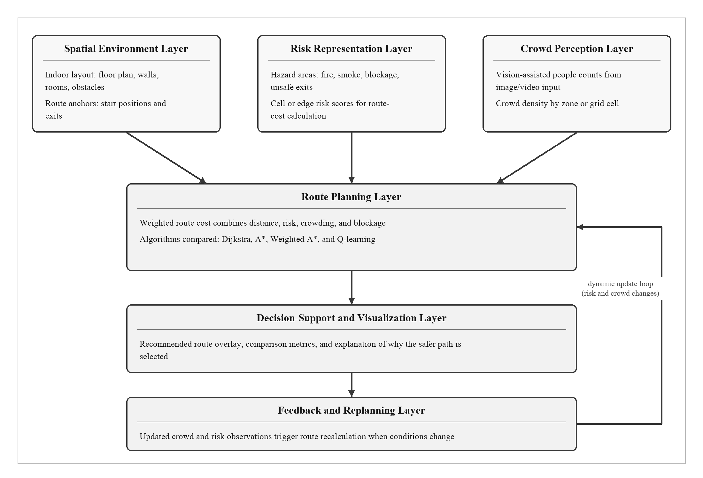

# A Conceptual Framework for Vision-Assisted Risk-Aware Evacuation Route Recommendation in Confined Indoor Environments

Ang Jin Sheng1, Jastini Mohd Jamil1, Izwan Nizal Mohd Shaharanee1

1 Department of Decision Science, School of Quantitative Sciences, Universiti Utara Malaysia, Sintok, Malaysia

## Abstract

Indoor evacuation route recommendation in confined environments should not depend only on the shortest path. In a real building, the shortest route may pass through a crowded corridor, a blocked area, smoke-affected space, or an exit that is no longer suitable. Previous studies have discussed indoor navigation, fire evacuation routing, dynamic risk-aware path planning, crowd detection, crowd counting, indoor localization, and decision-support systems. However, these areas are still often developed separately. Routing studies may assume that crowd and hazard information is already available, while vision-based crowd studies may stop at monitoring or people counting without showing how the detected crowd condition can change the recommended route. Therefore, this paper proposes a conceptual framework for vision-assisted risk-aware evacuation route recommendation in confined indoor environments. The framework is organized into six layers: spatial environment modelling, risk representation, crowd perception, route planning, decision-support visualization, and feedback-based replanning. A literature-based design science approach is used to develop the framework, and scenario walkthroughs are used to demonstrate how the framework responds to a high-risk corridor, a crowded exit, and a dynamic blockage or crowd update. The framework treats crowd condition as local density, converts crowd levels into route-cost input, and supports route explanation by comparing distance, risk exposure, crowd exposure, and total route cost. In short, the paper contributes a practical framework that connects vision-assisted crowd perception with risk-aware route planning and explainable decision support. It also provides a foundation for future simulation-based prototype development, expert validation, and later integration with real vision-based crowd-density estimation.

**Keywords:** indoor evacuation; risk-aware routing; crowd density; vision-assisted navigation; crowd perception; decision support; conceptual framework

## 1. Introduction

Indoor environments such as hospitals, campuses, shopping malls, transport terminals, libraries, office buildings, factories, and event halls are not simple movement spaces. They contain rooms, corridors, walls, doors, lifts, staircases, exits, restricted areas, and temporary obstacles. In normal situations, indoor navigation may only need to guide a user from one point to another. In emergency or high-density situations, the problem becomes more serious because the most direct path may not be the safest path.

Most navigation systems are designed to find the shortest or fastest route. This is useful when the environment is open, stable, and low risk. In confined indoor environments, however, a route has to be judged by more than distance. A corridor may be short but congested. An exit may be near but blocked. A path may be physically walkable but exposed to smoke, fire, low visibility, high crowd density, or other hazards. In this kind of situation, a longer route can be more useful if it helps people avoid risk and crowd pressure.

The challenge also changes over time. A route that is acceptable at the beginning may become crowded or blocked later. Fire, smoke, congestion, and human movement patterns can all change route suitability. Studies on indoor fire evacuation and dynamic routing show that geometric shortest-path assumptions are not enough when smoke, structural damage, congestion, and accessibility constraints are considered (Kim et al., 2026; Zhou et al., 2020). Crowd dynamics research also shows that high-density pedestrian movement can produce bottlenecks, jamming, and unsafe movement conditions (Helbing et al., 2000; Helbing & Johansson, 2013).

At the same time, computer vision and deep learning methods now make it possible to detect people, count pedestrians, and estimate crowd density from image or video input. YOLO-based models can detect people in low- to moderate-density scenes, while density-estimation methods can support crowd counting when individuals are heavily occluded (Chen et al., 2025; Gao et al., 2025; Yiğit, 2025). However, crowd detection alone does not solve the evacuation route problem. If a system only counts people, it remains a monitoring system. For decision support, the detected crowd condition must be translated into route-cost information that can influence the recommended path.

The research gap, therefore, is not simply the absence of crowd detection or the absence of routing algorithms. Both areas already exist. The gap is the weak connection between crowd perception, risk representation, route-cost modelling, and explainable decision support. A vision system may detect congestion, but if the result is not connected to route planning, it does not improve the route recommendation. A routing system may calculate a path, but if it does not receive updated crowd and hazard information, it may recommend a route that is no longer suitable.

Based on this gap, this paper proposes a conceptual framework for vision-assisted risk-aware evacuation route recommendation in confined indoor environments. The term "vision-assisted" is used because the framework can support multiple visual sensing sources, including CCTV, smartphone camera input, depth cameras, LiDAR-enabled mobile devices, or future vision-based density-estimation methods. The framework is not presented as a certified emergency evacuation system. It is proposed as a design-science artifact and decision-support structure that can guide future prototype development and simulation-based evaluation.

The objectives of this paper are:

1. To review relevant studies on indoor evacuation routing, risk-aware path planning, crowd perception, indoor positioning, and decision-support systems.
2. To identify design requirements for integrating vision-based crowd perception with risk-aware indoor route recommendation.
3. To propose a conceptual framework that links spatial environment modelling, risk representation, crowd perception, route planning, decision-support visualization, and feedback-based replanning.
4. To demonstrate the framework logic through scenario walkthroughs and propose future validation metrics.

The research questions are:

1. What limitations exist in shortest-path indoor routing under dynamic crowd and risk conditions?
2. How can vision-based crowd perception be converted into route-planning input?
3. How can a conceptual framework integrate risk, crowd density, route planning, and explainable decision support for confined indoor environments?

The remainder of this paper is organized as follows. Section 2 reviews related literature. Section 3 describes the methodology. Section 4 presents the proposed conceptual framework. Section 5 explains the process flow. Section 6 demonstrates the framework using scenario walkthroughs. Section 7 presents the validation plan. Section 8 discusses contributions, implications, and limitations. Section 9 concludes the paper and outlines future work.

## 2. Literature Review

### 2.1 Indoor Navigation and Evacuation Routing

Indoor navigation refers to guiding users from one indoor location to another using spatial information, route-planning algorithms, and positioning or environmental data. Unlike outdoor navigation, indoor navigation is difficult because Global Navigation Satellite System signals are often weak, unstable, or unavailable inside buildings. Indoor environments also contain many movement constraints, including walls, rooms, corridors, stairs, lifts, exits, obstacles, and restricted areas (Łukasik et al., 2024).

Indoor route planning is commonly represented using graph-based or grid-based models. In a graph model, important locations are represented as nodes and walkable connections are represented as edges. In a grid model, a floor plan is divided into cells. Each cell may represent a walkable area, wall, blocked area, risk area, crowd area, start point, or exit. These representations allow routing algorithms to compute a route across the indoor space.

Dijkstra and A* are common baseline algorithms for indoor route planning. Dijkstra's algorithm can find the shortest path when edge weights are non-negative. A* improves search efficiency by using a heuristic function to guide the search toward a destination. In evacuation studies, these algorithms are useful baselines because they are widely understood and easy to compare (Kim et al., 2026; Zhou et al., 2020).

However, route-planning performance depends strongly on how route cost is defined. If route cost only represents distance, the algorithm may select a short but unsafe path. Fire evacuation routing studies show that route calculation should consider semantics such as fire location, smoke distribution, path accessibility, and exit condition (Zhou et al., 2020). Dynamic evacuation studies further show that smoke and crowd congestion can produce irregular route-performance outcomes, meaning no single shortest-path algorithm is universally best under all dynamic conditions (Kim et al., 2026).

### 2.2 Risk-Aware Path Planning

Risk-aware path planning extends route calculation by adding safety-related factors to the cost function. Instead of treating all walkable areas as equal, risk-aware routing assigns higher cost to areas with greater hazard or movement difficulty. Risk factors may include fire, smoke, crowd congestion, blocked corridors, structural damage, low visibility, restricted areas, or inaccessible exits.

The key principle is that a route should be evaluated by its total suitability rather than only by its distance. A route that avoids smoke, congestion, or a blocked exit may be longer but safer. Therefore, a route-cost model can combine distance, risk exposure, crowd exposure, blockage penalty, and exit accessibility.

Dynamic evacuation research supports this direction. Kim et al. (2026) evaluated Dijkstra and A* under structural damage, smoke, and crowd congestion conditions in a multi-level underground station simulation. Under static structural damage, both algorithms produced identical maximum evacuation times, but A* required much less computation time. Under dynamic smoke and crowd congestion, performance varied by scenario and disaster location. This finding supports the need to evaluate routes under dynamic risk and crowd conditions rather than assuming one algorithm is always best.

Other studies also support the movement from shortest path to risk-aware routing. Three-dimensional indoor fire evacuation routing research shows that fire-related semantics and path accessibility can improve route safety compared with pure geometric routing (Zhou et al., 2020). Mobile evacuation guidance research also shows that dynamic edge weights, such as smoke density, fire proximity, and crowd congestion, can support safer route recalculation (Mocanu et al., 2026).

### 2.3 Crowd Density, Crowd Detection, and Crowd Counting

Crowd information is important in confined indoor evacuation because congestion affects movement speed, comfort, route capacity, and safety. A crowd should not be defined only by the total number of people. Twenty people in a large hall may not be crowded, but twenty people in a narrow corridor may create congestion. Therefore, this paper operationalizes crowd condition as local pedestrian density.

The basic density formula is:

```text
crowd_density = number_of_people_in_zone / zone_area_m2
```

For a grid-based route-planning model, the formula can be interpreted as:

```text
cell_density = detected_people_assigned_to_cell / real_world_cell_area_m2
```

For the proposed framework, crowd density can be categorized into practical levels as shown in Table 1. These categories are used as a conceptual guide for converting crowd perception into route-cost input. The exact threshold may be adjusted depending on building type, corridor width, camera placement, and safety policy.

**Table 1. Working crowd-density categories for route-cost scoring**

| Crowd level | Approximate density | Route-planning meaning |
|---|---:|---|
| Low | 0.5-1.5 persons/m2 | Movement is possible with limited interference |
| Medium | 1.5-3 persons/m2 | Movement is affected and route cost should increase |
| High | 3-4 persons/m2 | Congestion risk is significant |
| Critical | Above 4-5 persons/m2 | Area should be avoided when alternatives exist |

Crowd safety studies often warn that dense crowds above approximately 3-4 persons per square meter should be treated cautiously, and around 5 persons per square meter is commonly considered critical in crowd-risk contexts (Yin et al., 2019). This does not mean that a single universal threshold applies to every building. Rather, it supports the need to model crowd density as a risk factor rather than treating all walkable space equally.

Vision-based crowd perception can estimate this condition using several methods. YOLO-based object detection is suitable when people are visible as individual objects (Chen et al., 2025; Yiğit, 2025). However, YOLO may undercount people in dense scenes because of occlusion, perspective distortion, lighting variation, and overlapping bodies. Crowd-counting surveys show that density-map estimation can be useful when individual detection becomes difficult under high-density conditions (Gao et al., 2025). Therefore, the proposed framework allows crowd perception to use person detection, head detection, density-map estimation, tracking, or hybrid methods.

The important contribution is not the detection model alone. For evacuation route recommendation, the useful output is not merely "people detected." The useful output is "crowd density by zone" or "crowd score by route cell." This score can then be used by the route planning layer.

### 2.4 Indoor Positioning and User Location

Indoor positioning refers to estimating the location of a user, device, or object inside a building. It is not one sensor by itself. It is a system function that can use different signals, such as Wi-Fi, Bluetooth Low Energy beacons, Ultra-Wideband, inertial measurement units, camera-based localization, LiDAR, visual landmarks, QR codes, or sensor fusion methods.

Indoor positioning is relevant because a route recommendation system must know the user's start location. However, indoor localization remains challenging because GPS is unreliable indoors and no single indoor positioning method is universally dominant (Łukasik et al., 2024). Combining multiple data sources can improve accuracy, but it also increases system complexity.

For this Stage 1 conceptual framework, indoor positioning is treated as an enabling component rather than the main contribution. The framework assumes that the start point can be provided by manual selection, staff input, a mobile device, an indoor positioning module, or a future localization system. For prototype development, an iPhone or similar smartphone could support later implementation through camera input, inertial sensing, AR-based tracking, and, on some devices, LiDAR-assisted depth sensing. However, the first framework article should not overclaim real-time indoor positioning. The immediate contribution remains the link between crowd perception, risk scoring, route planning, and decision-support explanation.

### 2.5 Crowd Dynamics and Evacuation Behaviour

Crowd movement is complex because pedestrians do not behave as independent geometric points. Their movement is affected by density, bottlenecks, local interactions, route choice, visibility, social behaviour, and environmental constraints. Classic crowd-dynamics research has shown that evacuation situations can produce jamming and "faster-is-slower" effects, where increased pushing or urgency may reduce flow efficiency (Helbing et al., 2000). Later crowd and evacuation dynamics reviews explain how pedestrian interactions and self-organized movement patterns influence evacuation outcomes (Helbing & Johansson, 2013).

At the same time, modern discussions caution against simplistic assumptions about panic and irrational crowd behaviour. Haghani and Ronchi (2024) argue that the terminology and assumptions around panic, herding, and irrationality should be interpreted carefully and supported by empirical evidence. This is important for the present framework because it should not claim to model full human psychology. Instead, it treats crowd density as a measurable environmental condition that affects route cost.

Agent-based and simulation-based evacuation studies are useful for future evaluation because they can model multiple pedestrians, bottlenecks, and emergent crowd patterns. However, validation remains difficult due to limited empirical evacuation data and simplified modelling assumptions. Therefore, the present paper uses scenario walkthroughs for conceptual demonstration and proposes simulation-based evaluation as future work.

### 2.6 Decision Support and Explainability

A decision-support system should help users or decision-makers understand a recommendation. In evacuation route recommendation, simply outputting a path is not enough. A route may be longer than the shortest path, and users may question why it was selected. Therefore, the system should explain the trade-off between distance, risk, crowd exposure, blockage, and exit accessibility.

An explainable decision-support interface can show the indoor map, selected route, alternative routes, risk zones, crowd zones, blocked paths, exits, and route metrics. These metrics may include route distance, risk score, crowd score, total cost, computation time, and reduction in risk compared with a shortest-path baseline. The goal is to make the decision interpretable rather than opaque.

### 2.7 Design Science and Conceptual Framework Development

Design science research is suitable for studies that develop useful artifacts such as models, methods, frameworks, architectures, or prototypes (Hevner et al., 2004). The Design Science Research Methodology includes problem identification, objective definition, design and development, demonstration, evaluation, and communication (Peffers et al., 2007). This paper aligns with design science because it proposes a conceptual artifact to address a practical problem: how to integrate vision-based crowd perception with risk-aware indoor route recommendation.

The current paper focuses on framework design and scenario-based demonstration. It does not claim full deployment or certified emergency use. Future work should implement and evaluate the framework through simulation, prototype testing, and expert review.

### 2.8 Research Gap Summary

The reviewed literature shows that indoor evacuation routing, risk-aware path planning, crowd detection, density estimation, indoor positioning, and decision-support systems have each received research attention. However, these areas are commonly studied separately. Route-planning studies often focus on algorithmic route computation, while crowd perception studies often focus on detection accuracy or people counting. Decision-support explanation is not always integrated with algorithmic output.

The gap addressed by this paper is the lack of an integrated conceptual framework that connects vision-based crowd perception to risk-aware route-cost modelling and explainable evacuation route recommendation. Table 2 summarizes this gap.

**Table 2. Literature comparison and identified gap**

| Research stream | Existing contribution | Limitation for this study |
|---|---|---|
| Indoor navigation | Provides route guidance and graph/grid modelling | Often emphasizes distance or travel efficiency |
| Fire evacuation routing | Considers smoke, fire, accessibility, and dynamic hazards | May assume crowd/risk input is already available |
| Risk-aware path planning | Adds hazard and congestion factors into route cost | Often focuses on algorithm output rather than explanation |
| Crowd detection | Detects or counts people from visual input | Often stops at monitoring rather than route recommendation |
| Density estimation | Supports counting under occlusion and high density | Requires mapping into zones and route-cost scores |
| Indoor positioning | Estimates user location in indoor spaces | Remains difficult and may require multimodal sensing |
| Decision support | Visualizes recommendations and supports decisions | Needs live or updated risk/crowd input |
| Proposed framework | Integrates spatial, risk, crowd, routing, visualization, and feedback layers | Requires future prototype and validation |

## 3. Research Methodology

This study adopts a literature-based design science research approach. The output is a conceptual framework, and the framework is treated as a design artifact. The purpose is to organize the main components needed for vision-assisted risk-aware evacuation route recommendation in confined indoor environments.

The methodology consists of four stages:

1. **Problem identification.** The study begins from the problem that shortest-path routing may be unsuitable when indoor routes are affected by risk, crowd density, blockage, or dynamic conditions.
2. **Objective definition.** The objective is to integrate spatial modelling, risk representation, crowd perception, route planning, decision support, and feedback-based replanning.
3. **Framework design.** A six-layer conceptual framework is proposed, with each layer described through its role, input, process, and output.
4. **Scenario-based demonstration and validation planning.** Scenario walkthroughs are used to show the framework logic, followed by a proposed plan for expert review and simulation-based evaluation.

**Table 3. Design science mapping**

| Design science stage | Application in this paper |
|---|---|
| Problem identification | Shortest-path routing may be unsafe in crowded or hazardous indoor spaces |
| Objective definition | Develop an integrated framework for vision-assisted risk-aware route recommendation |
| Design and development | Propose six connected framework layers |
| Demonstration | Use scenario walkthroughs to show route-decision logic |
| Evaluation | Propose expert review and simulation-based validation |
| Communication | Present the framework as a conceptual article |

This paper is not a full systematic literature review. PRISMA guidance may be used in future work if a formal systematic review is conducted (Page et al., 2021). In the present study, the literature is used mainly to support framework construction and to identify design requirements.

## 4. Proposed Conceptual Framework

### 4.1 Framework Overview

The proposed framework is designed to connect visual crowd perception with route recommendation. The detail layers that happen in the framework are described as follows:

1. Spatial Environment Layer
2. Risk Representation Layer
3. Crowd Perception Layer
4. Route Planning Layer
5. Decision-Support and Visualization Layer
6. Feedback and Replanning Layer

The spatial environment layer provides the indoor layout. The risk representation layer assigns risk values to hazards and unsafe areas. The crowd perception layer estimates crowd density from visual input. The route planning layer combines distance, risk, crowd, blockage, and exit information. The decision-support layer visualizes and explains the route. Finally, the feedback and replanning layer updates the route when new conditions are detected.

**Figure 1. Proposed vision-assisted risk-aware evacuation route recommendation framework**



### 4.2 Layer 1: Spatial Environment Layer

The spatial environment layer represents the physical indoor layout. It includes corridors, rooms, walls, exits, staircases, lifts, doors, obstacles, restricted areas, and blocked spaces. This layer can use a floor plan, grid, graph, BIM model, or semantic indoor model.

For a grid-based implementation, each cell can be assigned a type, such as empty, wall, blocked, risk, crowd, start, or exit. For a graph-based implementation, locations can be represented as nodes and walkable links as edges. The output of this layer is a structured route-planning model.

### 4.3 Layer 2: Risk Representation Layer

The risk representation layer converts hazards and unsafe conditions into route-cost information. Risk may include fire, smoke, low visibility, blocked corridors, structural damage, restricted zones, or inaccessible exits. The risk score can be static or dynamic. For example, a static score may be assigned manually from known floor-plan information, while a dynamic score may be updated using sensor input, staff reports, or simulation output.

The route planning layer uses this score to avoid high-risk areas when alternatives exist. The intention is not to guarantee safety, but to support better-informed route decisions compared with distance-only routing.

### 4.4 Layer 3: Crowd Perception Layer

The crowd perception layer estimates crowd condition from visual input. Visual input may come from CCTV, fixed cameras, mobile phone cameras, depth cameras, or future vision-based sensing systems. Depending on the environment, the perception method may include:

- person detection using YOLO or similar object detectors;
- head detection for partially occluded scenes;
- density-map estimation for dense crowds;
- tracking and temporal smoothing to reduce frame-level noise;
- zone-based mapping from image regions to floor-plan areas.

The output is a crowd score or density level for each zone or route cell. This score is then sent to the route planning layer. In this way, visual crowd perception becomes useful for route recommendation, not only for monitoring.

### 4.5 Layer 4: Route Planning Layer

The route planning layer computes the recommended path using spatial, risk, and crowd information. The route is not selected by distance alone. Instead, route cost should include multiple factors:

```text
route_cost = distance_cost + risk_cost + crowd_cost + blockage_cost + exit_accessibility_cost
```

At cell or edge level, a simplified weighted model can be expressed as:

```text
cell_cost = alpha(distance) + beta(crowd) + gamma(risk) + delta(blockage)
```

where alpha, beta, gamma, and delta are weights. Increasing the risk weight makes the algorithm more likely to avoid hazardous areas. Increasing the crowd weight makes the algorithm more likely to avoid congested areas.

Dijkstra and A* can be used as shortest-path baselines. Weighted A* can be used as an explainable risk-aware method because it can combine heuristic search with weighted route costs. Learning-based methods, such as reinforcement learning, may be explored in future work, but they should be evaluated carefully rather than assumed to be better in every situation.

### 4.6 Layer 5: Decision-Support and Visualization Layer

The decision-support and visualization layer presents the recommendation in an understandable form. It should show the indoor map, recommended route, alternative route, start point, exits, risk zones, crowd zones, and blocked areas. It should also show route metrics such as:

- distance;
- risk exposure;
- crowd exposure;
- total route cost;
- computation time;
- reached exit;
- risk reduction compared with a shortest-path baseline.

This layer is important because safer routes may be longer. If the system recommends a longer route without explanation, users may not trust it. If the system shows that the shorter route has higher risk or crowd exposure, the recommendation becomes easier to understand and justify.

### 4.7 Layer 6: Feedback and Replanning Layer

The feedback and replanning layer updates the route when conditions change. New information may come from vision-based crowd detection, risk sensors, manual reports, user input, or simulation. When a corridor becomes crowded, an exit becomes blocked, or a risk zone changes, the system updates the relevant crowd or risk score and recalculates the route.

This feedback loop supports dynamic decision making. It also separates the framework from static navigation systems that calculate one route and assume the environment remains unchanged.

### 4.8 Framework Layer Summary

**Table 4. Framework layer summary**

| Layer | Main function | Input | Process | Output |
|---|---|---|---|---|
| Spatial environment | Represents indoor layout | Floor plan, walls, corridors, exits | Convert layout into graph/grid/model | Indoor route model |
| Risk representation | Represents hazards and unsafe areas | Fire, smoke, blockage, restricted areas | Assign risk values to locations | Risk map or score |
| Crowd perception | Estimates crowd level | Visual input from camera/depth/CCTV/mobile device | Detection, counting, density estimation | Crowd density or score |
| Route planning | Computes route recommendation | Map, risk, crowd, start, destination | Weighted path planning | Recommended route |
| Decision support | Explains and visualizes recommendation | Route result and metrics | Display route, scores, and explanation | Dashboard or guidance interface |
| Feedback and replanning | Updates route when conditions change | New crowd/risk/user data | Update scores and recalculate route | Revised route recommendation |

## 5. Framework Process Flow

The framework can be described as a step-by-step process:

1. **Indoor layout preparation.** The floor plan is converted into a route-planning model such as a grid or graph.
2. **Risk factor definition.** Risk zones, blocked areas, smoke-affected areas, or unavailable exits are assigned risk values.
3. **Crowd perception.** Visual input is processed to estimate people count or density by zone.
4. **Crowd-risk scoring.** Crowd density is converted into low, medium, high, or critical crowd scores.
5. **Route-cost calculation.** Distance, risk, crowd, blockage, and exit accessibility are combined into a weighted route cost.
6. **Route recommendation.** A route-planning algorithm recommends the lowest-cost route.
7. **Decision-support visualization.** The route, alternatives, risk/crowd zones, and explanation are displayed.
8. **Feedback and replanning.** Updated crowd or risk information triggers route recalculation when needed.

**Table 5. Process flow summary**

| Step | Process | Description |
|---|---|---|
| 1 | Layout preparation | Convert floor plan into map, grid, graph, or semantic model |
| 2 | Risk definition | Assign risk scores to hazards and blocked areas |
| 3 | Crowd perception | Detect people or estimate density from visual input |
| 4 | Crowd-risk scoring | Convert density into route-cost categories |
| 5 | Route calculation | Compute route using weighted cost |
| 6 | Visualization | Display route, metrics, and explanation |
| 7 | Replanning | Update route when conditions change |

## 6. Scenario Walkthrough

Scenario walkthroughs are used to demonstrate the framework logic. They do not represent final empirical validation. Their purpose is to show, in a simple way, how the framework responds to different indoor conditions.

### 6.1 Scenario 1: Shortest Path Through a Risk Zone

A user starts from Room A and needs to reach an exit. Two possible routes are available. Route A is shorter but passes through a high-risk corridor. Route B is longer but avoids the risk zone.

A distance-only system would normally select Route A. In the proposed framework, the risk representation layer assigns a higher risk value to the corridor. The route planning layer then combines distance and risk score. Although Route B is longer, it may have lower total cost because it avoids the high-risk area. The system therefore recommends Route B and explains that the shorter route has higher risk exposure.

### 6.2 Scenario 2: Nearest Exit With High Crowd Density

A user has access to two exits. Exit 1 is closer, but visual input detects high crowd density near Exit 1. Exit 2 is farther but less crowded.

The crowd perception layer estimates density near Exit 1 and classifies it as high. This value is converted into a crowd-risk score. The route planning layer increases the cost of routes that pass through the crowded exit area. The system may recommend Exit 2 because it reduces crowd exposure. The decision-support layer then explains that the nearest exit is avoided due to crowd density.

### 6.3 Scenario 3: Dynamic Crowd or Blockage Update

The system initially recommends Route A because it has acceptable distance, low risk, and low crowd exposure. Later, visual input detects increasing congestion along Route A, or staff reports that part of Route A is blocked.

The feedback and replanning layer updates the crowd or risk score. The route planning layer recalculates the route. If Route A is no longer suitable, the system recommends Route B. This scenario demonstrates the main idea of the framework: route recommendation should adapt when indoor conditions change.

**Table 6. Scenario walkthrough summary**

| Scenario | Condition | Distance-only decision | Framework decision | Explanation |
|---|---|---|---|---|
| Risk zone | Shortest route passes through high-risk area | Select shortest route | Select longer safer route | Risk score increases corridor cost |
| Crowded exit | Nearest exit has high crowd density | Select nearest exit | Recommend less crowded exit | Crowd score affects route cost |
| Dynamic update | Route becomes crowded or blocked | Continue original route | Recalculate route | Feedback layer updates route conditions |

## 7. Proposed Validation Plan

Because this paper presents a conceptual framework, validation should be conducted in stages. The first stage is expert review. The second stage is simulation-based prototype evaluation. The third stage is future real-world or semi-controlled testing after the prototype becomes more mature.

### 7.1 Expert Review

Expert review can evaluate whether the framework is clear, complete, feasible, and useful. Experts may come from indoor navigation, evacuation planning, computer vision, safety management, built environment, or information systems. They can review the framework diagram, layer descriptions, process flow, scenario walkthroughs, and proposed metrics before the system is developed further.

**Table 7. Expert review checklist**

| Evaluation item | Review question |
|---|---|
| Clarity | Are the layers and information flow easy to understand? |
| Completeness | Are important components missing from the framework? |
| Feasibility | Can the framework be implemented using current visual sensing and routing technologies? |
| Usefulness | Can the framework support safer route recommendation? |
| Explainability | Does the framework explain why a route is recommended? |
| Replanning | Is the feedback loop suitable for dynamic indoor conditions? |
| Scope control | Does the framework avoid overclaiming certified emergency performance? |

### 7.2 Simulation-Based Prototype Evaluation

Future work should implement the framework as a prototype and evaluate it using controlled scenarios. A grid-based or graph-based indoor model can be used to compare distance-only routing with risk-aware routing. Dijkstra and A* can be used as shortest-path baselines. Weighted A* can be used as the main explainable risk-aware method. Learning-based methods can be evaluated as additional comparison methods, but the comparison should focus on evidence rather than assumption.

**Table 8. Future quantitative evaluation metrics**

| Metric | Meaning | Preferred direction |
|---|---|---|
| Route distance | Number of steps or travel length | Lower, if safety is not reduced |
| Risk exposure score | Exposure to hazard or risk zones | Lower |
| Crowd exposure score | Exposure to crowded zones | Lower |
| Total route cost | Weighted route score | Lower |
| Computation time | Time needed to compute route | Lower |
| Route success rate | Whether the route reaches a valid exit | Higher |
| Delta distance vs Dijkstra | Additional distance compared with shortest-path baseline | Context dependent |
| Delta risk vs Dijkstra | Risk difference compared with shortest-path baseline | Lower |
| Risk reduction percentage | Reduction in risk compared with Dijkstra | Higher |
| Crowd reduction percentage | Reduction in crowd exposure compared with Dijkstra | Higher |
| Explanation clarity | Expert/user rating of route explanation | Higher |

### 7.3 Future Vision-Based Evaluation

Future implementation can integrate visual input to update crowd scores automatically. A first implementation may use YOLO-based person detection in low- to moderate-density scenes. A later implementation may use head detection, density-map estimation, or hybrid models in dense scenes. The evaluation should compare detected crowd level against manual counts or annotated data.

## 8. Discussion

### 8.1 Conceptual Contribution

The main contribution of this paper is the integration of six components that are often discussed separately: spatial environment modelling, risk representation, crowd perception, route planning, decision-support visualization, and feedback-based replanning. The framework shows how visual crowd information can become a route-planning input instead of remaining only as a monitoring output.

This contribution is important because crowd condition is a dynamic risk factor. A route that is suitable under low density may become unsuitable when congestion increases. By converting crowd density into a crowd-risk score, the framework gives the routing layer a practical way to reduce crowd exposure.

### 8.2 Practical Implications

The framework can guide future development of a decision-support prototype for buildings such as campuses, malls, libraries, hospitals, event venues, and transport terminals. A first prototype can use a floor plan with manually assigned risk and crowd zones. A later prototype can integrate visual crowd detection. Another extension can add indoor positioning for user location.

The framework can also support safety officers and building managers. Instead of only displaying a path, the system can explain why the path is recommended. For example, it can show that the selected route is longer but reduces risk exposure by a certain percentage compared with the Dijkstra shortest-path baseline. This type of explanation is important when the recommended route is not the shortest route.

### 8.3 Implementation Implications

The framework can be implemented gradually:

1. **Simulation phase.** Use a grid-based floor plan with manual risk and crowd scores.
2. **Vision phase.** Use visual input to estimate people count or crowd density by zone.
3. **Integration phase.** Convert detected crowd density into crowd-risk scores.
4. **Routing phase.** Compare Dijkstra, A*, Weighted A*, and selected learning-based methods.
5. **Decision-support phase.** Show route metrics, route overlays, and explanation text.
6. **Localization phase.** Add indoor positioning or mobile-device location estimation if required.

This staged approach keeps the work realistic. It also allows each component to be evaluated independently before any real deployment is considered.

### 8.4 Limitations

This paper has several limitations. First, the framework is conceptual and has not yet been fully validated in a real building. Second, scenario walkthroughs demonstrate the logic but do not provide empirical proof of safety improvement. Third, visual crowd perception may be affected by occlusion, perspective distortion, lighting variation, privacy requirements, camera placement, and domain shift. Fourth, indoor positioning is treated as a future enabling component and is not solved in this paper. Fifth, route recommendation should not be interpreted as certified emergency evacuation instruction without proper safety validation, regulatory review, and deployment testing.

Despite these limitations, the framework provides a useful foundation for future prototype development. It defines how crowd perception, risk scoring, route planning, and explanation can be connected in one decision-support structure.

## 9. Conclusion and Future Work

In a nutshell, this paper proposed a conceptual framework for vision-assisted risk-aware evacuation route recommendation in confined indoor environments. The framework is motivated by the limitation of shortest-path routing under conditions involving crowd density, hazards, blocked corridors, smoke, and unsuitable exits. It integrates six layers: spatial environment modelling, risk representation, crowd perception, route planning, decision-support visualization, and feedback-based replanning.

The proposed framework contributes by linking vision-based crowd perception to risk-aware route-cost modelling and explainable route recommendation. It operationalizes crowd condition as local density, supports the conversion of crowd levels into route-cost scores, and provides a structure for explaining why one route is recommended over another.

For future work, the framework should be implemented as a prototype and evaluated using simulation-based scenarios. The prototype should compare Dijkstra, A*, Weighted A*, and selected learning-based methods under risk and crowd conditions. Evaluation should include distance, risk exposure, crowd exposure, total cost, computation time, success rate, risk reduction percentage, crowd reduction percentage, and explanation clarity. Later work can integrate real visual crowd detection, density-map estimation, indoor positioning, and expert/user evaluation.

## References

Chen, Z., Xie, X., Qiu, T., & Yao, L. (2025). Dense-stream YOLOv8n: A lightweight framework for real-time crowd monitoring in smart libraries. *Scientific Reports, 15*, Article 11618. https://doi.org/10.1038/s41598-025-94659-x

Gao, G., Gao, J., Liu, Q., Wang, Q., et al. (2025). A survey of deep learning methods for density estimation and crowd counting. *Vicinagearth, 2*, Article 2. https://doi.org/10.1007/s44336-024-00011-8

Haghani, M., & Ronchi, E. (2024). Revisiting the paper "Simulating dynamical features of escape panic": What have we learnt since then? *Collective Dynamics, 9*, 1-11. https://doi.org/10.17815/CD.2024.168

Helbing, D., Farkas, I., & Vicsek, T. (2000). Simulating dynamical features of escape panic. *Nature, 407*, 487-490. https://doi.org/10.1038/35035023

Helbing, D., & Johansson, A. (2013). Pedestrian, crowd, and evacuation dynamics. arXiv:1309.1609. https://arxiv.org/abs/1309.1609

Hevner, A. R., March, S. T., Park, J., & Ram, S. (2004). Design science in information systems research. *MIS Quarterly, 28*(1), 75-105.

Kim, H., Haam, S., Yoo, M., & Song, W. S. (2026). Algorithmic evaluation of fire evacuation efficiency under dynamic crowd and smoke conditions. *Fire, 9*(1), Article 32. https://doi.org/10.3390/fire9010032

Lopez-Carmona, M. A., & Paricio Garcia, A. (2021). CellEVAC: An adaptive guidance system for crowd evacuation through behavioral optimization. *Safety Science, 139*, Article 105215. https://doi.org/10.1016/j.ssci.2021.105215

Łukasik, S., Szott, S., & Leszczuk, M. (2024). Multimodal image-based indoor localization with machine learning: A systematic review. *Sensors, 24*(18), Article 6051. https://doi.org/10.3390/s24186051

Mocanu, A., Avram, C., Radu, D., Sita, I. V., & Astilean, A. (2026). Assistive mobile application for fire emergency evacuation of visually impaired people. *Sensors, 26*(5), Article 1572. https://doi.org/10.3390/s26051572

Page, M. J., McKenzie, J. E., Bossuyt, P. M., Boutron, I., Hoffmann, T. C., Mulrow, C. D., et al. (2021). The PRISMA 2020 statement: An updated guideline for reporting systematic reviews. *BMJ, 372*, n71. https://doi.org/10.1136/bmj.n71

Peffers, K., Tuunanen, T., Rothenberger, M. A., & Chatterjee, S. (2007). A design science research methodology for information systems research. *Journal of Management Information Systems, 24*(3), 45-77. https://doi.org/10.2753/MIS0742-1222240302

Senanayake, G. P. D. P., Kieu, M., Zou, Y., & Dirks, K. (2024). Agent-based simulation for pedestrian evacuation: A systematic literature review. *International Journal of Disaster Risk Reduction, 111*, Article 104705. https://doi.org/10.1016/j.ijdrr.2024.104705

Yiğit, G. (2025). Crowd detection: Leveraging YOLO for human recognition. *Turkish Journal of Engineering, 9*(3), 571-577. https://doi.org/10.31127/tuje.1627839

Yin, J., Zheng, X.-M., & Tsaur, R.-C. (2019). Occurrence mechanism and coping paths of accidents of highly aggregated tourist crowds based on system dynamics. *PLOS ONE, 14*(9), e0222389. https://doi.org/10.1371/journal.pone.0222389

Zhou, Y., Pang, Y., Chen, F., & Zhang, Y. (2020). Three-dimensional indoor fire evacuation routing. *ISPRS International Journal of Geo-Information, 9*(10), Article 558. https://doi.org/10.3390/ijgi9100558
