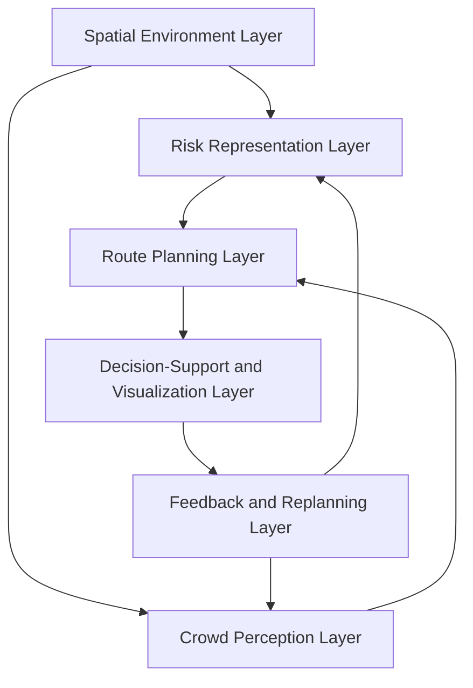

# Stage 1 Paper Writing Guide  
## Topic: Conceptual Framework for Risk-Aware Indoor Navigation and Crowd-Informed Decision Support in Confined Environments

---

# 1. Overall Summary

For **Stage 1**, your paper should focus on a **conceptual framework**, not the full system implementation yet.

The paper should explain how indoor navigation, risk-aware routing, crowd detection, and decision-support dashboard can be integrated into one framework for safer movement in confined environments.

The strongest writing angle is:

> Existing studies usually focus on indoor navigation, evacuation routing, crowd detection, or decision support separately. This paper proposes an integrated conceptual framework that connects spatial layout, risk representation, camera-based crowd sensing, route planning, and decision-support visualization for safer indoor navigation in confined environments.

This type of paper can be submitted to Scopus, but it should not look like only an idea. It should include:

- Strong literature review
- Clear research gap
- Proposed layered framework
- Scenario walkthrough
- Expert validation plan or expert review
- Clear future implementation direction

---

# 2. Recommended Paper Title

## Best Title

**A Conceptual Framework for Camera-Assisted Risk-Aware Indoor Navigation and Crowd-Informed Decision Support in Confined Environments**

## Alternative Titles

1. **Beyond Shortest Paths: A Conceptual Framework for Crowd- and Hazard-Sensitive Indoor Navigation**

2. **Integrating Crowd Sensing and Risk-Aware Routing: A Decision-Support Framework for Safe Indoor Navigation**

3. **Toward Safe Indoor Navigation: A Systematic Framework for Crowd-Informed and Risk-Aware Path Planning**

4. **A Camera-Assisted Risk-Aware Indoor Navigation Framework for Confined Spaces**

---

# 3. Main Research Gap

You can write the research gap like this:

> Existing indoor navigation and evacuation systems often focus on shortest-path routing, while crowd detection systems usually focus on monitoring or people counting. However, limited studies provide an integrated framework that connects real-time or camera-based crowd sensing with risk-aware route planning and decision-support visualization. Therefore, there is a need for a conceptual framework that integrates spatial environment modelling, risk representation, crowd perception, adaptive route planning, and explainable decision support for confined indoor environments.

---

# 4. Suggested Research Aim

The aim of this paper is:

> To propose a conceptual framework for camera-assisted risk-aware indoor navigation and crowd-informed decision support in confined environments.

---

# 5. Suggested Research Objectives

Use 3 objectives for Stage 1.

## RO1  
To review existing studies on indoor navigation, evacuation routing, risk-aware path planning, crowd detection, and decision-support systems.

## RO2  
To identify the research gaps and key design requirements for integrating crowd sensing with risk-aware indoor navigation.

## RO3  
To propose a conceptual framework that integrates spatial environment modelling, risk representation, crowd perception, route planning, decision support, and feedback-based replanning.

---

# 6. Suggested Research Questions

Make the research questions match the objectives.

## RQ1  
What are the existing approaches used in indoor navigation, evacuation routing, risk-aware path planning, crowd detection, and decision-support systems?

## RQ2  
What research gaps and design requirements exist for integrating crowd sensing with risk-aware indoor navigation?

## RQ3  
How can a conceptual framework be designed to integrate spatial environment modelling, risk representation, crowd perception, route planning, decision support, and feedback-based replanning?

---

# 7. Suggested Paper Structure and What to Write

---

## Abstract

### What to write

Write around 150–200 words.

Include:

- Problem: shortest path may not be safest
- Gap: navigation and crowd detection are often separate
- Aim: propose conceptual framework
- Method: literature-based framework development using design science approach
- Contribution: layered framework for crowd-informed risk-aware navigation
- Future work: prototype and simulation validation

### Sample Abstract

Indoor navigation in confined environments requires more than shortest-path routing because the shortest route may pass through crowded, hazardous, or blocked areas. Existing studies have explored indoor evacuation routing, risk-aware path planning, and camera-based crowd detection; however, these areas are often treated separately. This paper proposes a conceptual framework for camera-assisted risk-aware indoor navigation and crowd-informed decision support in confined environments. The framework integrates six layers: spatial environment modelling, risk representation, crowd perception, route planning, decision-support visualization, and feedback-based replanning. The framework is developed through a literature-based design science approach and supported by scenario walkthroughs to demonstrate how crowd and hazard information can influence safer route decisions. The proposed framework contributes by connecting camera-based crowd sensing with adaptive route planning and explainable decision support. This study provides a theoretical foundation for future prototype development, simulation-based evaluation, and real-world crowd detection integration.

---

## 1. Introduction

### What to write

Write about:

- Why indoor navigation is important
- Why confined environments are risky
- Why shortest path is not always safe
- Why crowd density and hazards matter
- Why a framework is needed before full system development

### Key points to include

- Confined spaces include malls, event halls, hospitals, campuses, stadiums, transport terminals, and indoor public buildings.
- Shortest route may become unsafe if it passes through fire, smoke, crowd congestion, blocked exits, or risky corridors.
- Existing navigation systems often focus on shortest route.
- Existing crowd detection systems often stop at monitoring or people counting.
- Your paper proposes an integrated conceptual framework.

### Example paragraph

Indoor navigation in confined environments is increasingly important because people often need to move safely through complex spaces such as hospitals, campuses, shopping malls, event halls, and transport terminals. In these environments, the shortest path may not always be the safest path because congestion, blocked corridors, hazards, or inaccessible exits can increase movement risk. Therefore, route recommendation should consider not only distance but also environmental risk and crowd conditions.

---

## 2. Literature Review

Divide the literature review into 5 subsections.

---

### 2.1 Indoor Navigation and Evacuation Routing

### What to write

Explain:

- Indoor navigation helps users move from one point to another inside buildings.
- Common algorithms include Dijkstra and A*.
- Traditional systems often focus on shortest path or shortest time.
- In emergency or crowded situations, shortest path may be unsafe.

### Related articles to read

1. **Three-Dimensional Indoor Fire Evacuation Routing**  
   Link: https://www.mdpi.com/2220-9964/9/10/558  
   Why useful: Explains why shortest path may not be safe during fire and proposes fire-aware indoor evacuation routing.

2. **Algorithmic Evaluation of Fire Evacuation Efficiency Under Dynamic Crowd and Smoke Conditions**  
   Link: https://www.mdpi.com/2571-6255/9/1/32  
   Why useful: Compares route algorithms under smoke and crowd conditions.

3. **Assistive Mobile Application for Fire Emergency Evacuation of Visually Impaired People**  
   Link: https://pubmed.ncbi.nlm.nih.gov/41829532/  
   Why useful: Discusses dynamic route computation and limitations of static evacuation guidance.

---

### 2.2 Risk-Aware Path Planning

### What to write

Explain:

- Risk-aware path planning considers hazards, smoke, fire, blocked paths, and congestion.
- Route cost can be adjusted based on risk level.
- A safer route may be longer but reduce exposure to danger.

### Related articles to read

1. **Dynamic Risk Perception-Based Evacuation Path Optimization Framework in Metro Fire Scenarios**  
   Link: https://papers.ssrn.com/sol3/papers.cfm?abstract_id=5682701  
   Why useful: Shows how smoke data can be included in path cost for evacuation.

2. **Three-Dimensional Indoor Fire Evacuation Routing**  
   Link: https://www.mdpi.com/2220-9964/9/10/558  
   Why useful: Uses semantic fire information and route cost functions.

3. **Algorithmic Evaluation of Fire Evacuation Efficiency Under Dynamic Crowd and Smoke Conditions**  
   Link: https://www.mdpi.com/2571-6255/9/1/32  
   Why useful: Useful for explaining dynamic route updates based on congestion and smoke.

---

### 2.3 Crowd Detection and Crowd Counting

### What to write

Explain:

- Crowd detection can be done using cameras and computer vision.
- YOLO can detect people in images/videos.
- Crowd detection alone is not enough; it should be connected to decision-making.
- For your framework, camera-based detection provides crowd-risk input to the navigation system.

### Related articles to read

1. **Crowd Detection: Leveraging YOLO for Human Recognition**  
   Link: https://dergipark.org.tr/en/pub/tuje/article/1627839  
   Why useful: Compares YOLOv5, YOLOv8, and YOLOv11 for human detection in crowded environments.

2. **Dense-stream YOLOv8n: A Lightweight Framework for Real-Time Crowd Monitoring in Smart Libraries**  
   Link: https://www.nature.com/articles/s41598-025-94659-x  
   Why useful: Shows YOLO-based real-time crowd monitoring in a confined indoor-like environment.

3. **A Survey of Deep Learning Methods for Density Estimation and Crowd Counting**  
   Link: https://link.springer.com/article/10.1007/s44336-024-00011-8  
   Why useful: Gives background on crowd counting and density estimation.

---

### 2.4 Agent-Based Simulation and Crowd Evacuation

### What to write

Explain:

- Agent-based simulation is commonly used to model pedestrian movement and evacuation.
- It is useful for testing indoor navigation and crowd behaviour.
- This supports your later Phase 1 simulation paper.

### Related article to read

1. **Agent-Based Simulation for Pedestrian Evacuation: A Systematic Literature Review**  
   Link: https://www.sciencedirect.com/science/article/pii/S2212420924004679  
   Why useful: Reviews agent-based evacuation simulation and highlights challenges such as data scarcity and model validation.

---

### 2.5 Design Science Research and Framework Development

### What to write

Explain:

- Your paper proposes a conceptual artifact/framework.
- Design Science Research is suitable because it supports the design of useful IT artifacts.
- Even conceptual frameworks should be grounded in literature and validated.

### Related articles to read

1. **Design Science in Information Systems Research**  
   Link: https://www.jstor.org/stable/25148625  
   Why useful: Foundational design science research paper by Hevner et al.

2. **A Design Science Research Methodology for Information Systems Research**  
   Link: https://doi.org/10.2753/MIS0742-1222240302  
   Alternative PDF link: https://wise.vub.ac.be/sites/default/files/thesis_info/Design_Science_Research_Methodology_2008.pdf  
   Why useful: Explains DSR stages such as problem identification, objective definition, design, demonstration, evaluation, and communication.

3. **The PRISMA 2020 Statement**  
   Link: https://pubmed.ncbi.nlm.nih.gov/33782057/  
   Why useful: Use this if you want to conduct a systematic or structured literature review.

---

# 8. Proposed Conceptual Framework Section

This is the most important section.

## What to write

Present your framework as a layered architecture.

## Suggested framework layers

```text
Layer 1: Spatial Environment Layer
Layer 2: Risk Representation Layer
Layer 3: Crowd Perception Layer
Layer 4: Route Planning Layer
Layer 5: Decision-Support and Visualization Layer
Layer 6: Feedback and Replanning Layer
```

---

## Layer 1: Spatial Environment Layer

### What to write

This layer represents the indoor environment.

It includes:

- floor layout
- rooms
- walls
- corridors
- exits
- obstacles
- blocked paths

### Example writing

The spatial environment layer represents the physical indoor layout, including corridors, walls, exits, and movement constraints. This layer provides the basic spatial structure required for route planning and risk analysis.

---

## Layer 2: Risk Representation Layer

### What to write

This layer represents environmental risks.

It includes:

- fire
- smoke
- blocked corridor
- high-risk zone
- low visibility
- inaccessible exit

### Example writing

The risk representation layer transforms environmental hazards into route-cost information. Instead of treating all walkable areas equally, this layer assigns higher risk values to hazardous or less accessible zones.

---

## Layer 3: Crowd Perception Layer

### What to write

This layer uses camera-based crowd detection.

It includes:

- video input
- YOLO person detection
- people counting
- density estimation
- crowd status classification

### Example writing

The crowd perception layer provides dynamic crowd information using camera-based human detection. A pretrained YOLO model can detect people from video frames and estimate crowd density. The resulting crowd level can then be converted into a risk score for route planning.

---

## Layer 4: Route Planning Layer

### What to write

This layer decides the route.

It may include:

- Dijkstra
- A*
- Weighted A*
- Reinforcement learning in future work

### Example writing

The route planning layer receives spatial, risk, and crowd information and generates a recommended path. Unlike conventional shortest-path algorithms, the proposed framework supports risk-aware routing by considering distance, crowd exposure, hazard exposure, and exit accessibility.

---

## Layer 5: Decision-Support and Visualization Layer

### What to write

This layer explains the route decision.

It includes:

- route map
- risk score
- crowd score
- explanation panel
- dashboard visualization

### Example writing

The decision-support layer visualizes route recommendations and explains why a particular route is selected. This improves transparency by showing whether the system prioritizes distance, lower crowd exposure, or hazard avoidance.

---

## Layer 6: Feedback and Replanning Layer

### What to write

This layer updates the route when conditions change.

It includes:

- updated crowd detection
- updated hazard data
- route recalculation
- alert/recommendation update

### Example writing

The feedback and replanning layer enables the framework to respond to changing indoor conditions. When crowd density increases or a hazard appears, the system updates the risk map and recalculates the route.

---

# 9. Diagram to Include

Use this framework diagram in the paper.



---

# 10. Suggested Methodology Section

## What to write

Use a **literature-based Design Science Research approach**.

### Suggested methodology paragraph

This study adopts a design science research approach to develop a conceptual framework for risk-aware indoor navigation and crowd-informed decision support. The framework is developed based on a structured review of existing studies on indoor navigation, evacuation routing, crowd detection, risk-aware path planning, and decision-support systems. The reviewed literature is used to identify key limitations in existing approaches and derive the main framework components. The proposed framework is then demonstrated through scenario walkthroughs and prepared for future prototype implementation and empirical evaluation.

---

# 11. Suggested Scenario Walkthrough Section

Since this is only a framework paper, include 2–3 scenarios to show how the framework works.

---

## Scenario 1: High-Risk Corridor

### Input

- Start point: Room A
- Exit: Exit 1 and Exit 2
- Corridor A: high-risk zone
- Corridor B: normal zone

### Expected framework decision

The system avoids Corridor A and recommends Corridor B, even if Corridor B is longer.

---

## Scenario 2: Crowded Exit

### Input

- Camera detects high crowd density near Exit 1
- Exit 2 is farther but less crowded

### Expected framework decision

The system recommends Exit 2 because the crowd-risk score near Exit 1 is higher.

---

## Scenario 3: Dynamic Risk Update

### Input

- Initially, Corridor A is safe
- Later, camera or sensor input detects congestion or blockage

### Expected framework decision

The system updates the risk map and recalculates the route.

---

# 12. Validation Section

For a framework-only paper, you need some validation.

## Minimum validation

Use:

```text
Expert review + scenario walkthrough
```

## Expert review plan

Ask 3–5 experts to review:

- framework clarity
- framework completeness
- practical relevance
- feasibility
- usefulness of camera-based crowd input
- usefulness of decision-support dashboard

## Suggested expert review table

| Evaluation Item | Question |
|---|---|
| Clarity | Are the framework layers clearly explained? |
| Completeness | Are important components missing? |
| Practicality | Can this framework be applied to real indoor spaces? |
| Relevance | Is crowd-informed routing useful for confined environments? |
| Feasibility | Can the system be implemented using current technology? |
| Decision support | Is the dashboard explanation useful for users? |

---

# 13. Discussion Section

## What to write

Discuss:

- How your framework addresses the gap
- Why integration is the key contribution
- How it differs from existing studies
- Why it is useful for future prototype development
- Limitations

### Example points

- Existing studies may handle evacuation routing but not camera-based crowd input.
- Existing YOLO crowd detection studies may count people but do not convert crowd count into route decision.
- Your framework connects crowd sensing with risk-aware route planning.
- The framework is conceptual and requires future simulation/prototype validation.

---

# 14. Conclusion Section

## What to write

Summarize:

- The paper proposed a conceptual framework.
- It integrates spatial, risk, crowd, route planning, decision-support, and feedback layers.
- It addresses the gap between crowd detection and indoor navigation.
- Future work will implement the framework as a prototype and evaluate routing algorithms.

### Sample conclusion paragraph

This paper proposed a conceptual framework for camera-assisted risk-aware indoor navigation and crowd-informed decision support in confined environments. The framework integrates spatial environment modelling, risk representation, crowd perception, route planning, decision-support visualization, and feedback-based replanning. The main contribution is the integration of crowd sensing and risk-aware route planning into a unified decision-support structure. Future work will implement the framework as a prototype, evaluate route recommendation algorithms, and integrate camera-based crowd detection for dynamic route updating.

---

# 15. Related Article Links Compilation

## Indoor Navigation and Evacuation

1. Three-Dimensional Indoor Fire Evacuation Routing  
   https://www.mdpi.com/2220-9964/9/10/558

2. Algorithmic Evaluation of Fire Evacuation Efficiency Under Dynamic Crowd and Smoke Conditions  
   https://www.mdpi.com/2571-6255/9/1/32

3. Assistive Mobile Application for Fire Emergency Evacuation of Visually Impaired People  
   https://pubmed.ncbi.nlm.nih.gov/41829532/

4. Multimodal Image-Based Indoor Localization with Machine Learning—A Systematic Review  
   https://www.mdpi.com/1424-8220/24/18/6051

---

## Risk-Aware Path Planning

5. Dynamic Risk Perception-Based Evacuation Path Optimization Framework in Metro Fire Scenarios  
   https://papers.ssrn.com/sol3/papers.cfm?abstract_id=5682701

6. Three-Dimensional Indoor Fire Evacuation Routing  
   https://www.mdpi.com/2220-9964/9/10/558

7. Algorithmic Evaluation of Fire Evacuation Efficiency Under Dynamic Crowd and Smoke Conditions  
   https://www.mdpi.com/2571-6255/9/1/32

---

## Crowd Detection and Crowd Counting

8. Crowd Detection: Leveraging YOLO for Human Recognition  
   https://dergipark.org.tr/en/pub/tuje/article/1627839

9. Dense-stream YOLOv8n: A Lightweight Framework for Real-Time Crowd Monitoring in Smart Libraries  
   https://www.nature.com/articles/s41598-025-94659-x

10. A Survey of Deep Learning Methods for Density Estimation and Crowd Counting  
   https://link.springer.com/article/10.1007/s44336-024-00011-8

---

## Agent-Based Simulation and Evacuation

11. Agent-Based Simulation for Pedestrian Evacuation: A Systematic Literature Review  
   https://www.sciencedirect.com/science/article/pii/S2212420924004679

---

## Design Science Research and Review Methodology

12. Design Science in Information Systems Research  
   https://www.jstor.org/stable/25148625

13. A Design Science Research Methodology for Information Systems Research  
   https://doi.org/10.2753/MIS0742-1222240302

14. PDF version of Peffers et al. Design Science Methodology  
   https://wise.vub.ac.be/sites/default/files/thesis_info/Design_Science_Research_Methodology_2008.pdf

15. PRISMA 2020 Statement  
   https://pubmed.ncbi.nlm.nih.gov/33782057/

---

# 16. Suggested Tables to Include in the Paper

## Table 1: Literature Comparison Table

| Study | Focus Area | Crowd Input | Risk-Aware Routing | Decision Support | Gap |
|---|---|---|---|---|---|
| Zhou et al. | Fire evacuation routing | No | Yes | Limited | Focuses on fire semantics |
| Kim et al. | Dynamic crowd and smoke routing | Yes | Yes | Limited | Algorithm focus, less dashboard support |
| Yiğit | YOLO crowd detection | Yes | No | No | Detects people but no route recommendation |
| Gao et al. | Crowd counting review | Yes | No | No | Focuses on counting/density estimation |
| Proposed framework | Integrated navigation and crowd decision support | Yes | Yes | Yes | Combines all components |

---

## Table 2: Framework Layer Summary

| Layer | Function | Input | Output |
|---|---|---|---|
| Spatial Environment | Represents indoor layout | Floor plan, walls, exits | Indoor map |
| Risk Representation | Represents hazards | Fire, smoke, blockage | Risk map |
| Crowd Perception | Detects crowd level | Camera/video | Crowd density score |
| Route Planning | Computes route | Map, risk, crowd | Recommended route |
| Decision Support | Explains route | Route results | Dashboard visualization |
| Feedback | Updates system | New risk/crowd data | Replanned route |

---

## Table 3: Scenario Walkthrough

| Scenario | Condition | Framework Decision |
|---|---|---|
| High-risk corridor | Shortest route passes risk area | Recommend longer safer route |
| Crowded exit | Exit 1 is congested | Recommend Exit 2 |
| Dynamic update | Crowd increases after route generated | Recalculate route |

---

# 17. What to Avoid

Do not claim:

- The framework is already fully implemented.
- The system is a certified evacuation system.
- YOLO-based crowd detection is new by itself.
- Shortest path is always wrong.
- Your framework guarantees safety.

Use safer wording:

- “decision-support framework”
- “conceptual framework”
- “risk-informed route recommendation”
- “crowd-informed decision support”
- “future prototype evaluation”

---

# 18. Final Writing Strategy

Your Stage 1 paper should be written as:

```text
Literature review + research gap + conceptual framework + scenario walkthrough + expert validation plan
```

Not as:

```text
I want to build an app.
```

The strongest contribution is:

> This paper integrates indoor spatial modelling, hazard/risk representation, camera-based crowd perception, route planning, and explainable decision support into one conceptual framework for safer indoor navigation in confined environments.

---

# 19. Recommended Next Steps

## Step 1  
Read the 15 listed articles.

## Step 2  
Create a literature comparison table.

## Step 3  
Draw the framework diagram.

## Step 4  
Write the Introduction and Literature Review.

## Step 5  
Write the Proposed Framework section.

## Step 6  
Create 2–3 scenario walkthroughs.

## Step 7  
Ask 3–5 experts to review the framework.

## Step 8  
Write Discussion, Limitation, and Future Work.

## Step 9  
Format according to target journal.

---

# 20. Best Target Paper Type

For Stage 1, your article type should be:

```text
Conceptual framework paper
```

or

```text
Design science conceptual paper
```

or

```text
Framework development paper with literature-based validation
```

The paper is publishable if you add enough literature support and at least lightweight validation.
